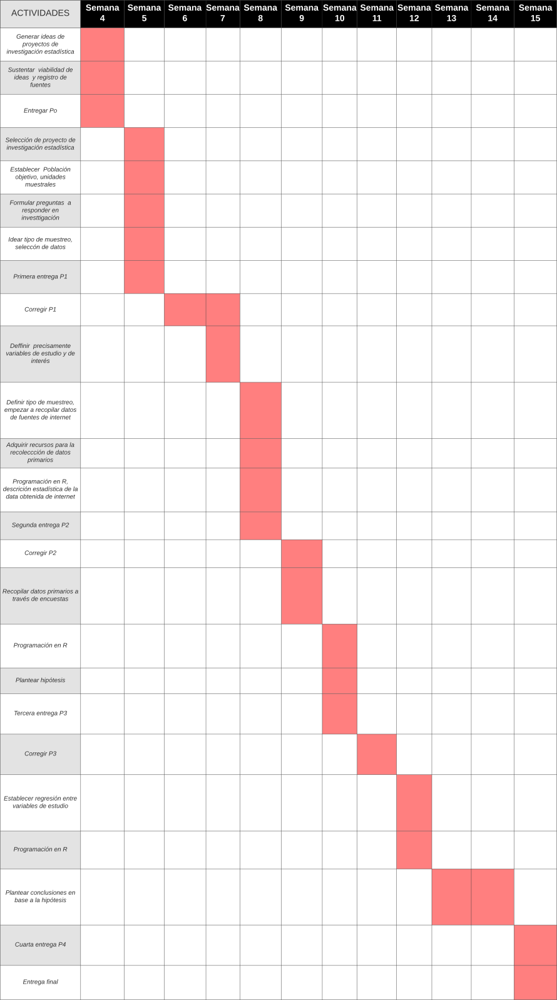

s---
title: "Efecto de las medidas tomadas por el gobierno peruano frente al COVID-19"
output:
  html_notebook:
    theme: darkly
  html_document:
    df_print: paged
---

<style> body {text-align: justify} </style>

```{r,echo=FALSE,message=FALSE}
# No olvides instalar las dependencias
library(berryFunctions)
library(curl)
library(tidyverse)
library(tm)
library(wordcloud)

## ---- covid
tmp <- tempfile()
curl_download("https://cloud.minsa.gob.pe/s/Y8w3wHsEdYQSZRp/download", tmp)

readLines(tmp) %>%
    iconv(from = "ISO-8859-1", to = "UTF-8") %>%
    read_csv() %>%
    mutate(FECHA_RESULTADO = lubridate::ymd(FECHA_RESULTADO)) -> df

## ---- movilization
tmp <- tempfile()
curl_download("https://www.gstatic.com/covid19/mobility/Global_Mobility_Report.csv", tmp)
read_csv(tmp,
    # Esta parte dejaba de funcionar cada vez que había una cambio en las variables
    col_types = cols(
        country_region_code = col_character(),
        contry_region = col_character(),
        sub_region_1 = col_character(),
        sub_region_2 = col_character(),
        metro_area = col_character(),
        iso_3166_2_code = col_character(),
        census_fips_code = col_character(),
        date = col_date(),
        retail_and_recreation_percent_change_from_baseline = col_double(),
        grocery_and_pharmacy_percent_change_from_baseline = col_double(),
        parks_percent_change_from_baseline = col_double(),
        transit_stations_percent_change_from_baseline = col_double(),
        workplaces_percent_change_from_baseline = col_double(),
        residential_percent_change_from_baseline = col_double()
    )) %>%
    filter(country_region_code == "PE") -> df_mov

## ---- infec
df %>%
    group_by(FECHA_RESULTADO) %>%
    summarise(N = n()) %>%
    arrange(FECHA_RESULTADO) %>%
    mutate(NSUM = cumsum(N)) -> df_infec

## ---- plot_new_cases
plot_new_cases <- function(day, min_day, max_day, main_title) {
    df_infec %>%
        filter(FECHA_RESULTADO >= min_day & FECHA_RESULTADO <= max_day) -> df_tmp

    df_infec %>%
        filter(FECHA_RESULTADO >= min_day & FECHA_RESULTADO < day) -> df_tmp_a

    df_infec %>%
        filter(FECHA_RESULTADO > day & FECHA_RESULTADO <= max_day) -> df_tmp_b

    df_tmp %>%
        plot(N~FECHA_RESULTADO, data = ., main = main_title, xlab = "Fecha", ylab = "Nuevos casos")

    mean1 <- mean(df_tmp_a$N)
    segments(as.Date(min_day)-1, mean1, as.Date(day), mean1, col = "red")

    median1 <- median(df_tmp_a$N)
    segments(as.Date(min_day)-1, median1, as.Date(day), median1, col = "blue")

    mean2 <- mean(df_tmp_b$N)
    segments(as.Date(day), mean2, as.Date(max_day)+1, mean2, col = "red", lty = 2)

    median2 <- median(df_tmp_b$N)
    segments(as.Date(day), median2, as.Date(max_day)+1, median2, col = "blue", lty = 2)

    legend("topright", legend=c("Promedio antes", "Mediana antes", "Promedio después", "Mediana después"),
       col=c("red", "blue", "red", "blue"), lty=c(1,1,2,2), cex=0.8)
}

## ---- plot_sum_cases
plot_sum_cases <- function(day, min_day, max_day, main_title) {
    df_infec %>%
        filter(FECHA_RESULTADO >= min_day & FECHA_RESULTADO <= max_day) %>%
        plot(NSUM~FECHA_RESULTADO, data = ., main = main_title, xlab = "Fecha", ylab = "Casos totales")
}

## ---- plot_rmoves
plot_rmoves <- function(day, min_day, max_day, main_title) {
    df_mov %>%
        group_by(date) %>%
        summarise(mov = mean(retail_and_recreation_percent_change_from_baseline, na.rm = TRUE)) -> df_tmp

    df_tmp %>% filter(date >= min_day & date < day) -> df_tmp_a
    df_tmp %>% filter(date > day & date <= max_day) -> df_tmp_b
    df_tmp %>% filter(date >= min_day & date <= max_day) -> df_tmp

    df_tmp %>%
        plot(main = main_title, xlab = "Fecha", ylab = "Cambio de movilizacion")

    mean1 <- mean(df_tmp_a$mov)
    segments(as.Date(min_day)-1, mean1, as.Date(day), mean1, col = "red")

    median1 <- median(df_tmp_a$mov)
    segments(as.Date(min_day)-1, median1, as.Date(day), median1, col = "blue")

    mean2 <- mean(df_tmp_b$mov)
    segments(as.Date(day), mean2, as.Date(max_day)+1, mean2, col = "red", lty = 2)

    median2 <- median(df_tmp_b$mov)
    segments(as.Date(day), median2, as.Date(max_day)+1, median2, col = "blue", lty = 2)

    legend("topright", legend=c("Promedio antes", "Mediana antes", "Promedio después", "Mediana después"),
       col=c("red", "blue", "red", "blue"), lty=c(1,1,2,2), cex=0.8)
}

## ---- cat_function
cat_function <- function(f_name, min_day, max_day) {
    cat("```{r}\n")
    cat(f_name)
    cat("(\"")
    cat(format(as.Date(min_day), "%Y-%m-%d"))
    cat("\", \"")
    cat(format(as.Date(max_day), "%Y-%m-%d"))
    cat("\")\n```\n\n")
}

## ---- cat_title
cat_title <- function(f_title, min_day, max_day) {
    cat("##",
        f_title,
        format(as.Date(min_day), "%m-%d"),
        "->",
        format(as.Date(max_day), "%m-%d"),
        "\n"
    )
}

## ---- cat_plot
cat_plot <- function(day, range,  main_title, fun, title) {
    min_day <- day - range
    max_day <- day + range

    cat_title(title, min_day, max_day)
    cat_function(berryFunctions::getName(fun), min_day, max_day)

    # Print date in title
    date_str <- paste("(",format(as.Date(day), "%Y-%m-%d") ,")", sep="")
    fun(day, min_day, max_day, paste(main_title, date_str))
    abline(v = as.Date(day))

    cat("\n.\n\n\n")
}

## ---- repeat_plots
repeat_plots <- function(day, range, main_title = "") {
    day <- lubridate::ymd(day)
    cat_plot(day, range, main_title, plot_new_cases, "Nuevos casos")
    cat_plot(day, range, main_title, plot_rmoves, "Movilización recreacional")
}
```

[](https://github.com/2020-01-est-19/proyecto/actions?query=workflow%3A%22R+CI%22)
[](./pres.html)
[](https://github.com/2020-01-est-19/proyecto)

# Profesor:
* Jose Miguel Renom

# Curso:
* Estadística y Probabilidades

# Integrantes
* Génesis Flores Arroyo
* Angel Salvador Calleja Castillo
* Esteban Villacorta Garcia
* Alberto Oporto Ames
* Ricardo Atsuhiko Yamamoto Yamamoto

# Líder
* Alberto Oporto Ames

# Introducción
El COVID-19 ha tenido un gran impacto alrededor del mundo y hoy en dia es fácilmente
el tema del que más se habla.
Todos los países han tomado medidas con respecto a esta pandemia,
sin embargo unos las han tomado muy tarde y esto se ha visto afectado en la expansión
del virus en ellos.
En Perú, las medidas se empezaron a tomar rápidamente,
pero una cantidad considerable de la población no ha cumplido con las inmovilizaciones
sociales y esto se ha visto reflejado en la expansión del virus en el país.
¿Cómo podemos saber cuáles han sido las medidas más respetadas y por qué?
La respuesta a esta pregunta le sería de mucha ayuda al gobierno peruano,
ya que con esta información se podría saber que tipo de medidas debería tomar y en qué
momentos para que se cumplan de manera satisfactoria.
Es por ello que nuestro grupo ha decidido investigar acerca de la efectividad de las
medidas tomadas y su relación con la movilización social de los ciudadanos.

# Factibilidad
Este trabajo es factible, debido a que la mayor parte de la información la podemos
conseguir de gráficos ya existentes con relación al COVID-19 en Perú y la información
faltante la podemos adquirir a través de encuestas.
Además, los efectos de las medidas tomadas por el gobierno en la movilización social ya
se pueden analizar, debido a que su información se obtiene solamente días después de
implementarlas.
Finalmente, esta investigación se puede llevar a cabo en el tiempo dado,
debido a que no es un trabajo que requiera tiempo de espera para llegar a concretarse.
Esto quiere decir que lo podemos empezar inmediatamente.

# Objetivos
La importancia de este estudio estadístico radica en el análisis de algunas de las
medidas que el gobierno ha declarado ante la coyuntura del Covid-19.
Es importante estudiar su efecto en la movilización social,
puesto que podría otorgar un panorama más holístico y verídico sobre las medidas que
generan un impacto positivo en la desaceleración de la propagación del
nuevo virus Sars-CoV-2.

## Objectivos generales
* El objetivo de este trabajo es determinar en qué medida las diferentes acciones
que ha aplicado el gobierno, desde el inicio del periodo de cuarentena hasta el
tiempo del estudio,  redujeron el impacto y expansión
del Covid-19 en el Perú.
Queremos averiguar el efecto de estas medidas en 2 diferentes aspectos.
Estos son: la movilización social y
de qué manera afectan la curva de aumento de infectados por coronavirus en Perú.

## Objetivos específicos
* Establecer las medidas a estudiar y que estas se encuentren alineadas a
la inmovilización social.
* Desarrollar habilidades de comunicación haciendo uso del programa R-Studio y el lenguaje de R.
* Establecer los factores que determinan la prestación de servicios públicos y
su relación con la propagación del virus.
* Establecer una relación entre el bono subsidio y
el desacato a la inmovilización social.
* Establecer las principales razones de las personas para
desobedecer la inmovilización social.

# Marco Teórico

## Población objetivo
La población de interés son los ciudadanos peruanos.
Para lograr que nuestras unidades muestrales sean los más representativa posible,
hemos decidido delimitar nuestra población objetivo al área de Lima.
Esto se debe a que nuestros encuestados se encuentran en esta zona y
la mayor cantidad de población se encuentra aquí.

## Unidad muestral
* Para las encuestas nuestra unidad muestral son los alumnos de la Universidad UTEC y sus familias [18 - 50 años]
* Con respecto a los datos y gráficos brindados por la web, nuestra unidad muestral es la ciudad de Lima.
* Accederemos a las observaciones y/o mediciones de las unidades muestrales mediante
fuentes de internet que presentan fiabilidad, respaldo del gobierno.
Del mismo modo, se realizarán encuestas a los alumnos de UTEC y sus familiares
a través de preguntas relacionadas con su movilización social antes y durante la
cuarentena.
Ello con el propósito de encontrar las razones de movilización

## Muestreo
Tipo de muestreo

El tipo de muestreo es aleatorio simple estratificado para ciudadanos con edades
entre 18-50 años.
Ello, dado que todos los individuos de subconjunto de la población objetivo
tienen la misma probabilidad de ser seleccionados.

## Tamaño de la muestra
* Para la investigación, se busca cumplir por lo menos con:
<0.05, e<0.05
*Para encontrar un número mínimo de personas a entrevistar, manteniendo una confianza de 95% y margen de error de 5%, se utilizó la siguiente fórmula:

$$n = Z^2p(1-p)/e^2$$

Como no hay todavía datos para obtener el valor real de p, se asume p = 0.5. Con ello, se obtiene un tamaño de muestra de por lo menos 91 personas para ser significativo.

# Proveniencia de los datos
Existen varias fuentes de la que es posible extraer la información necesaria
para responder las preguntas.

* Compendio de normas emitidas por el Estado Peruano para afrontar la propagación
  del Covid-19. (1 de febrero de 2020 al 7 de mayo de 2020)
* Normativa sobre Estado de Emergencia por Coronavirus.
* Acciones adoptadas por el gobierno ante COVID-19 (2020)
* COVID-19 Community Mobility Report (2020).

*Nota: Todas se encuentran citadas en bibliografía.*

La información contenida en estas direcciones son originales,
además de confiables, dado que se presenta cada medida con su respectivo decreto
legislativo.
Asimismo, los datos estadísticos cuentan con sustento de fuentes oficiales.

# Uso de datos

Con respecto al uso de los datos obtenidos de fuentes, tenemos claro cómo utilizar cada uno de ellos.
La fuente de la que adquirimos la información respecto a las medidas tomadas nos es de
mucha ayuda, ya que junto a ellas están las fechas en las que se llevaron a cabo.
Esto nos permite analizar la población antes y después de que se implementarán
estas medidas.

Las fuentes de las que adquirimos las gráficas de inmovilización social también nos
son de gran ayuda porque nos permiten relacionar las fechas en las que se llevaron
a cabo las medidas gubernamentales con el flujo de gente en las calles.
Esta relación es muy importante, ya que nos permitirá analizar la efectividad de
los decretos y nos ayudará a lograr nuestros objetivos.
El procesamiento de la data obtenida en las fuentes es muy importante,
debido a que por sí solas nos muestran información “cruda” que todo el mundo ya conoce.
Al procesar esta data y relacionarla con otra/s, la investigación se vuelve más
interesante, ya que las relaciones entre diferentes estadísticas son
posiblemente desconocidas y le brindan información mucho más útil al lector.

# Planificación



# Medidas elegidas

1. Decreto de estado de emergencia.
    - ¿Cuál fue el efecto que tuvo el decreto de estado de emergencia en
    la población emocionalmente? (Exploratoria)

2. Decreto de Urgencia que dicta medidas extraordinarias con la finalidad de
adquirir bienes y servicios necesarios para el alojamiento en cuarentena y
alimentación de las personas que deban desplazarse dentro del país a
consecuencia de la declaración del Estado de Emergencia Nacional por el COVID-19 (380)
    - ¿La cantidad de personas que se vieron beneficiadas por este decreto fue
    suficiente para que se reduzca considerablemente el tránsito de gente? (Inferencial)

3. Aprueban el Padrón de los hogares en condición de pobreza o pobreza extrema
beneficiarios del subsidio monetario de acuerdo al Sistema de Focalización de
Hogares (SISFOH) que se encuentren en los ámbitos geográficos con mayor
vulnerabilidad sanitaria en el marco del D.U. N° 027-2020 (68)
    - ¿La tasa de personas que reciben la bonificación por día fue alcanzable a la
    mayoría de personas del sector vulnerable? (Descriptiva)

4. Disposición presidencial que permite la salida de hombres y mujeres en días
complementarios (lunes-miércoles-viernes / martes-jueves-sábados)
    - ¿Qué diferencia hubo en el tránsito de personas entre los días para hombres y
    para mujeres? (Descriptiva)
    - ¿A dónde se dirige la mayor parte del flujo de personas? ¿Qué razón explicaría esto? (Exploratoria)

##  Preguntas propuestas para estudio (para los encuestados)

|N° | Pregunta | Tipo |
|---|----------|------|
|1  |¿Qué edad tienen los miembros de la muestra?| Descriptiva|
|2  |¿De qué género son?| Descriptiva|
|3  |¿Cuánto es su ingreso promedio?| Descriptiva|
|4  |¿En qué distrito vives?| Descriptiva|
|5  |¿Cuál fue el último nivel educativo que completaste?| Descriptiva|
|6  |¿Su tipo de empleo es formal o informal?| Descriptiva|
|7  |¿Qué tan frecuentemente salía de casa previamente al comienzo de la cuarentena?| Descriptiva|
|8  |¿Qué tanto consideras que tu distrito se ha visto afectado por la enfermedad?| Descriptiva|
|9  |¿Por qué razones salías durante la cuarentena?| Descriptiva|
|10  |¿Consideras que esta medida “c/u de las medidas” fue efectiva para reducir el número de contagios en tu distrito?| Descriptiva|
|11|¿Qué condiciones crees que aceleran la propagación del Covid en tu distrito?| Descriptiva|
|12 |¿Qué condiciones crees que retardan la propagación del Covid en tu distrito?| Descriptiva|
|13 |¿Qué medidas gubernamentales son las que recuerdas que se hayan tomado?| Descriptiva|


##  Preguntas propuestas para estudio (para la data)


|N° | Pregunta | Tipo |
|---|----------|------|
|14  |¿Qué tanto varían las cifras de nuevos infectados durante los periodos de instauración previos-posteriores a la medida?| Descriptiva|
|15  |¿Cuáles eran las razones por las que la población salía durante la cuarentena?| Descriptiva|
|16  |¿Cuáles han sido las medidas que han tenido mayor impacto en la población?| Descriptiva|
|17  |Existe una misma tendencia de poblaciones afectadas por el Covid 19 durante las medidas de aislamiento? | Exploratoria|
|18  |¿Las medidas en los distritos más exclusivos presentan una mayor o menor efectividad?| Exploratoria|
|19  |¿La entrega de mayores subsidios monetarios resultaría en un importante beneficio para la disminución del número de salidas?| Inferencial|
|20  |¿Es posible predecir cuántas horas en promedio una persona salía de casa conociendo su nivel de ingresos y el distrito de residencia?| Predictiva|
|21  |¿Es posible predecir su nivel de ingresos conociendo únicamente su tipo de empleo?| Predictiva|
|22  |¿Qué factores determinan que la propagación del Covid 19 se desacelere?| Causal|
|23  |¿Cómo ciertas condiciones determinan que la propagación del COVID se acelere / retarde?| Mecanística|

# Variables

|Variable| Relación con pregunta| Tipo de variable|
|--------|-----------------|
|Edad| 1| Cuantitativa discreta|
|Género| 2| Cualitativa nominal|
|Clase social| 3,17,18,20,21| Cualitativa ordinal|
|Nivel educativo alcanzado| 5,17,18| Cualitativa ordinal|
|Tipo de trabajo| 6,18,21| Cualitativa nominal|
|Frecuencia de salida | 7,18,19| Cuantitativa discreta|
|Lugar donde vive (distrito)| 4,17,18,20| Cualitativa nominal|
|Cantidad de infectados por dia| 14,19| Cuantitativa discreta|
|Tiempo antes y despues de las medidas|14,17,18| Cuantitativa continua|
|Justificacion de salida| 9,15| Cualitativa nomilal|
|Medidas aplicadas| 10,16,17,18,19| Cualitativa nominal|
|Factores| 22,23| Cualitativa nominal|

# Descriptores numéricos para las variables de mayor importancia:

## Variables Data web

* Cantidad  de  personas que se movilizan en las calles antes y después de cada una de las medidas, Tiempo, Medidas aplicadas:

- Media (valor): permitirá  conocer en promedio cuántos  ciudadanos limeños se movilizan  antes y después de la medida

- Mediana, cuartiles (valor): permitirá saber cuántos ciudadanos limeños se movilizan al 25%, 50%; 75%, 100%  del tiempo de estudio, de esta manera se conocerá  el efecto de la movilización con el transcurso del tiempo para cada medida.

- Desviación estándar: permitirá saber cuántas son las variaciones promedio  de movilización social respecto a la media

## Cantidad de infectados por día, tiempo:

* Media(valor): permitirá conocer cuánto es la tasa infectados que  hubo en promedio antes y después de medida aplicada

* Mediana, cuartiles (valor): permitirá saber cuántos infectados hubo al 25%, 50%;75%, 100%  del tiempo de estudio, de esta manera se conocerá  el efecto del número de infectados con el transcurso del tiempo para cada medida.

* Desviación estándar: permitirá saber cuántas son las variaciones promedio de infectados respecto a la media.

# Variables Encuestas

## Frecuencia de salida promedio a la semana

* Mediana, cuartiles (valor): permitirá saber cuántas salidas a la semana representa 25%,50%,75% de los ciudadanos de Lima encuestados para cada medida y variable de interés

* Moda (valor): permitirá saber la frecuencia de salida mayoritaria de los ciudadanos de Lima encuestados

## Tipo de trabajo

* Frecuencia de observaciones para cada tipo de trabajo en relación a su frecuencia de salida

## Edad

* Mediana, cuartiles (valor): permitirá saber cuántas salidas a la semana representa 25%,50%,75% de los ciudadanos de Lima encuestados para cada frecuencia de salida, y cada medida

## Distrito

* Moda(valor): permitirá conocer en qué distrito inciden más en las veces de salida de las personas

## Ingresos mensuales

* Moda(valor): permitirá conocer el nivel de ingresos por cada distrito.


## Género
*Frecuencia de observaciones para cada género en relación a su frecuencia de salida

# Descriptores gráficos

### Utilizaremos:

Gráfica de dispersión para notar fácilmente como aumenta o decrece la cantidad de infectados e infectados por dia antes y después de que se aplique la medida. Además, la gráfica de dispersión nos puede ayudar a encontrar una relación y/o patrón entre la cantidad de infectados y/o movilización social y los días transcurridos desde que se empleó cada medida.

También utilizaremos un gráfico de caja de bigotes para diferenciar las edades de los entrevistados de manera rápida y efectiva. Esto nos permitirá ver la relación entre las edades y respuestas dadas por las personas.

Además, se utilizarán gráficos de barras principalmente para visualizar y analizar las respuestas cualitativas. Con los gráficos de barras se podrán ver cuales han sido las respuestas cualitativas respondidas con más y menos frecuencia.

Finalmente, se usarán histograma para describir las variables cuantitativas que pueden ser distribuidas en rangos. Esto nos facilitará analizar los datos con muchos valores o respuestas posibles.

## Plots y otras cosas
```{r}
# curl -Ls "$url" > df_form.csv

tmp <- tempfile()
curl_download("https://docs.google.com/spreadsheets/d/e/2PACX-1vS5FwsKHl4PhukIHfSGbfA8NCQ5SqBDpQ16KC69JCiFAWVeJ40BACp0dqhBTkHi9cpLE_JmEmIvfdvA/pub?gid=637100843&single=true&output=csv", tmp)
read_csv(tmp) -> df_form1

# Segunda encuesta
tmp <- tempfile()
curl_download("https://docs.google.com/spreadsheets/d/e/2PACX-1vS5FwsKHl4PhukIHfSGbfA8NCQ5SqBDpQ16KC69JCiFAWVeJ40BACp0dqhBTkHi9cpLE_JmEmIvfdvA/pub?gid=637100843&single=true&output=csv", tmp)

read_csv(tmp) %>%
    rename(
        tiempo = "Marca temporal",
        edad = "¿Cuál es tu edad?",
        genero = "¿De qué género eres?",
        ingreso = "¿Cuánto es el ingreso mensual promedio de tu familia aproximadamente (soles) ?",
        distrito = "¿En qué distrito vives?",
        estudio = "¿Cuál fue el último nivel educativo que completaste?",
        empleo = "¿Cuál es tu tipo de empleo?",
        salidas = "¿Cuántas veces a la semana, en promedio, salías de casa durante los días de cuarentena?",
        razones = "¿Por qué razones salías durante la cuarentena?",
        social.bool = "¿La medida de \"Inmovilización social\", realmente hizo que tus salidas durante toda la cuarentena fueran muy pocas?",
        social.05 = "Respecto a la anterior pregunta. Del 0 al 5, ¿ En cuánto disminuyó tus salidas durante la cuarentena?",
        ocio.bool = "¿ La \"Suspensión de acceso a lugares públicos: lugares de ocio, restaurantes, etc\", te desanimó salir de casa?",
        ocio.05 = "Respecto a la anterior pregunta. Del 0 al 5, ¿Cuánto te desanimó salir de casa?",
        noday.bool = "¿La medida \"Disposición salida de hombres y mujeres en días complementarios (lunes-miércoles-viernes / martes-jueves-sábados)\", garantizo que salieras menos que antes?",
        noday.05 = "Respecto a la anterior pregunta. Del 0 al 5, ¿Cuánto cambio tus salidas?",
        multa.bool = "¿ La medida \"Multa de S/.86 -S/.340 para todas las personas que desobedecen disposiciones del gobierno\", hizo que tus salidas de casa fueran menores?",
        multa.05 = "Respecto a la anterior pregunta. Del 0 al 5, ¿Cuán menores fueron tus salidas?",
        bono.bool = "¿ La medida \"Entrega de bono S/. 380, S/.760 de acuerdo al Sistema de Focalización de Hogares (SISFOH) \", permitió que redujeras tus salidas de casa?",
        bono.05 = "Respecto a la anterior pregunta. Del 0 al 5, ¿Cuánto se redujo tus salidas?",
        afp1.bool = "¿ La medida \"Retiro de hasta S/. 2000 de fondos AFP de trabajadores afiliados que no tienen planilla\", te mantuvo más tiempo en casa?",
        afp1.05 = "Respecto a la anterior pregunta. Del 0 al 5, ¿ Cuán más te mantuviste en casa?",
        afp2.bool = "¿ La medida \"Retiro del 25% de fondos AFP para trabajadores afiliados\", te mantuvo más tiempo en casa?",
        afp2.05 = "Respecto a la anterior pregunta. Del 0 al 5, ¿Cuánto tiempo más te mantuvo en casa?",
        decceleration = "¿Qué condiciones crees que existen en tu distrito que retardan la propagación del Covid?",
        acceleration = "¿Qué condiciones crees que existen en tu distrito que aceleran la propagación del Covid?"
    ) %>%
    mutate(
        genero = as.factor(genero),
        ingreso = as.factor(ingreso),
        distrito = as.factor(distrito),
        estudio = factor(estudio, levels = c("Secundaria", "Técnica", "Universitaria", "Posgrado")),
        empleo = factor(empleo, levels = c("No trabajo", "Informal", "Formal")),
        # Esteban Nicolas Villacorta Garcia cambió las respuestas de la encuesta
        # de "Mayor 5" a 6.
        salidas_ = salidas,
        salidas = replace(salidas, salidas=="6", "Mayor 5"),
        salidas = factor(salidas, levels = c(0:5, "Mayor 5")),
        razones = strsplit(razones, ", "),
        social.bool = social.bool == "Sí" | social.bool == "Si",
        ocio.bool = ocio.bool == "Sí" | ocio.bool == "Si",
        noday.bool = noday.bool == "Sí" | noday.bool == "Si",
        multa.bool = multa.bool == "Sí" | multa.bool == "Si",
        bono.bool = bono.bool == "Sí" | bono.bool == "Si",
        afp1.bool = afp1.bool == "Sí" | afp1.bool == "Si",
        afp2.bool = afp2.bool == "Sí" | afp2.bool == "Si",
        acceleration = strsplit(acceleration, ", "),
        decceleration = strsplit(decceleration, ", ")
    ) -> df_form2
df_form2
```

### Edad de la muestra
```{r}
summary(df_form2$edad)
boxplot(df_form2$edad, xlab = "", ylab = "Edad", main=NULL)
title("Gráfico 1. Edad")
```

$$n = 310, sd = 12.619$$

### Género
```{r}
df_form2 %>%
    group_by(genero) %>%
    summarise(n = n()) %>%
    barplot(n~genero, data=., xlab="Personas", ylab="Cantidad")

title("Gráfico 2. Género")
```

### Ingreso promedio

```{r}
par(mai = c(0.8, 1.5, 0.2, 0.5))
df_form2 %>%
    group_by(ingreso) %>%
    summarise(n = n()) %>%
    barplot(n~ingreso, data=., horiz = TRUE, las = 2, xlab = "Personas", ylab="")
title(ylab="Ingreso", line=6)
title("Gráfico 3. Ingresos")
```

### Distrito
```{r, fig.width=12, fig.height=20}
par(mai = c(1, 2, 0.5, 0.5))
#plot(edad~distrito, data = df_form2, horizontal=TRUE, las=2, xlab="")
#title(ylab="Distrito", line=8)

df_form2$distrito %>%
    table() %>%
    sort(TRUE) %>%
    barplot(horiz = TRUE, las = 2, xlab = "Personas", ylab="")
title("Gráfico 4. Distrito")
```

### Empleo
```{r}
par(mai = c(1, 1.5, 0.5, 0.5))
df_form2$empleo %>%
    table() %>%
    sort(TRUE) %>%
    barplot(horiz = TRUE, las = 2, xlab = "Personas", ylab="")

title("Gráfico 5. Tipo de trabajo")
```

### ¿Qué tanto varían las cifras de nuevos infectados durante los periodos de instauración previos-posteriores a la medida?

Para esta primera pregunta se han procesado los datos web. Se presentarán dos gráficos por cada una de las cuatro medidas que se analizarán. El primero de ellos será de los nuevos casos y el segundo de la movilización recreacional (cambios en la movilización). Los descriptores que se están utilizando para describir mejor los datos obtenidos es la media y mediana. Es necesario destacar que se ha optado por graficar los datos diez días antes de que se decrete la medida y diez días después de haberse promulgado.

### Frecuencia de salidas VS ingresos
```{r}
ggplot(aes(x = salidas_, y = ingreso), data = df_form2) +
    geom_boxplot() +
    ggtitle("Salidas vs ingresos") +
    theme(plot.title = element_text(hjust = 0.5))
```

# Declaración del Estado de Emergencia

En esta gráfica podemos visualizar que la cantidad de infectados por día bajó en algunos días inmediatamente después de que se declarará el estado de emergencia. Se puede apreciar en la gráfica que se lleva a cabo cada 2 o 3 días durante la semana siguiente a la implementación del Estado de Emergencia. Esto se podría deber a factores como la cantidad de pruebas tomadas por día, frecuencia de salida de las personas y el cumplimiento de las leyes y medidas tomadas.

```{r,echo=FALSE,message=FALSE,results="asis"}
cat_plot(lubridate::ymd("2020-03-15"), 10, "Gráfico 6. Declaración del estado de Emergencia", plot_new_cases, "Nuevos casos")
```
Para analizar esta gráfica, se asume que el crecimiento de la enfermedad bajo condiciones normales es exponencial. Por tanto, se puede construir un modelo tal que:
ln(y) ~ At+B. Tomando a L1 como regresión de control sin variable independiente y L2 la regresión luego de aplicarse la medida, se realizó un F-test para comprobar si el modelo L1 modela a L2 sin diferencias significativas.

* Ho : No existen diferencias significativas entre ambos modelos.
* Ha : Existen diferencias significativas entre el modelo anterior a la medida y el actual.

|F - Test Two - Sample for Variances |
|---|----------|------|
| | Variable 1| Variable 2 |
|---|----------|------|
|Mean  |1.55950355| 3.603577946|
|Variance  |1.30751423| 0.201678854|
|Observations |10| 9|
|df  |9| 8|
|F  |6.48314984| |
|P (F <= f) one-tail  |0.00746629| |
|F crítico one-tail  |3.38813023| |
|---|----------|------|

Dado que la varianza 1 > varianza 2, la elección del orden de las variables es correcta. Por tanto, dado F > F crítico, se encuentra evidencia para falsear Ho. Dado α > P(F<=f) una cola, se rechaza la hipótesis nula, por lo que existen diferencias significativas. Comparando las pendientes A1=0.337 y A2=0.0729 con A2 <A1, se puede asumir que se frenó la expansión de la enfermedad.

```{r,echo=FALSE,message=FALSE,results="asis"}
cat_plot(lubridate::ymd("2020-03-15"), 10, "Gráfico 7. Declaración del estado de Emergencia", plot_rmoves, "Movilización recreacional")
```
A partir del gráfico 7, se logra visualizar que previo a la promulgación de la medida “Declaración de Estado de Emergencia”, la gente tenía mucha más movilización y luego de decretada, el cambio de movilización disminuyó en gran medida. El promedio y mediana (líneas continuas) antes de que se aplique esta medida es aproximadamente -3. Por otro lado, el promedio y mediana (líneas punteadas) desde el quince hasta el veinticinco está por debajo de -60.

Para comprobar la significancia de esta diferencia, se realizó un test-t de medias. Se asumieron las siguientes hipótesis:

* Ho : No existe un efecto significativo de la medida por sobre las medias del Cambio de Movilización.
* Ha : Existen diferencias significativas entre las medias de la variable Cambio de Movilización para antes y después de ejecutarse la medida.

|t - Test Two Assuming Unequal Variances |
|---|----------|------|
| | Variable 1| Variable 2 |
|---|----------|------|
|Mean  |-3.363636364| -71.1818182|
|Variance  |15.65454545| 113.363636|
|Observations |11| 11|
|df  |13| |
|t Stat  |19.8023634| |
|P (T <= t) one-tail  |2.15261E-11| |
|t crítical one-tail  |1.770933396| |
|P (T <= t) two-tail  |4.30521E-11| |
|t crítical two-tail  |2.160368656| |
|---|----------|------|

Dado que el valor |t| > t-crítico dos colas, se puede encontrar evidencia para rechazar la hipótesis nula Ho. Dado α =0.05 > P(T<=t) dos colas, existe significancia suficiente para ello. Por tanto, se rechaza Ho, existiendo por tanto diferencias significativas entre antes de ejecutarse la declaración de Estado de Emergencia y después sobre la movilización de las personas. Debido a que el coeficiente de correlación es menor a 0, se puede afirmar que el cambio además redujo la movilización.

## Aprobación del Padrón de Hogares

Este gráfico nos muestra la cantidad de casos diez días antes y diez días después de que la medida “Aprobación del Padrón de Hogares” fuera aprobada. Esta es una gráfica muy importante, dado que tenía como objetivo ayudar a las poblaciones más vulnerables en condición de extrema pobreza a nivel nacional para que pudieran subsistir durante la cuarentena. Dicho en otras palabras, para que pudieran acceder a los servicios básicos y medicamentos, en caso fuesen requeridos. La cantidad de casos antes de que la medida fuese declarada, 08/03 hasta 18/03,  va desde aproximadamente uno hasta veinte. No obstante, desde 18/03 hasta 28/03 la cantidad de casos va en aumento. Sin duda alguna, el objetivo era bueno, pero para el panorama que se estaba viviendo no fue efectiva. Una posible hipótesis sería la salida obligatoria de los beneficiarios a los bancos a formar largas colas durante horas. Esto explicaría el aumento de casos.

```{r,echo=FALSE,message=FALSE,results="asis"}
cat_plot(lubridate::ymd("2020-03-18"), 10, "Gráfico 8. Aprobación del Padrón de Hogares", plot_new_cases, "Nuevos casos")
```
Se realizó un f-test sobre los inputs a la regresión lineal del logaritmo de la gráfica, siguiendo el modelo planteado arriba. Se colocó como control a todos los datos previos a declararse la medida. Se plantearon las siguientes hipótesis:

* Ho : No existe un efecto significativo de la medida por sobre la tendencia de los nuevos casos con respecto al control.
* Ha : Existen un efecto significativo entre las muestras de control y la data posterior a la declaración.

|F - Test Two - Sample for Variances |
|---|----------|------|
| | 0| 3.27714 |
|---|----------|------|
|Mean  |1.538879| 3.218122|
|Variance  |0.949329| 0.148907|
|Observations |9| 9|
|df  |8| 8|
|F  |6-.375321| |
|P (F <= f) one-tail  |0.008398| |
|F crítico one-tail  |3.438101| |
|---|----------|------|

Dado que la primera varianza es mayor a la segunda, el orden de operación de los datos es correcto. Como tal, dado F > F-critico una cola, encontramos evidencia en contra de Ho. Dado ademas P(F<=f) < α , se puede garantizar la decisión de rechazar la hipótesis nula, por lo que deben existir diferencias significativas entre los datos. Dado además A1= 0.2672 > A2=0.0116, se puede afirmar que la medida redujo la tasa de infección.

```{r,echo=FALSE,message=FALSE,results="asis"}
cat_plot(lubridate::ymd("2020-03-18"), 10, "Gráfico 9. Aprobación del Padrón de Hogares", plot_rmoves, "Movilización recreacional")
```
Esta gráfica, al igual que la Gráfica 7, manifiesta un comportamiento similar. Sin embargo, a partir de la disminución de la curva se podrían generar algunas conjeturas. La primera de ellas es que las personas tenían un respaldo para poder comprar sus alimentos y medicamentos de ser necesario por lo que ya no tenían que salir a las calles de manera concurrida a vender productos, entre otras cosas. Cabe resaltar que con esto no queremos decir que la población no salía y que la medida fue 100% efectiva. Al contrario, la población objetivo salió para hacer el retiro del subsidio por lo que el número de casos aumentó. Sin embargo, esto también contribuyó a que en días posteriores se queden en casa, debido a que contaban con dinero para subsistir por un par de semanas más (varía según el número de integrantes). Estas afirmaciones se respaldan con la media y mediana antes del decreto (líneas continuas), dado que se ubica en la parte superior del gráfico, mientras que la media y mediana (líneas punteadas) por debajo de -60.

Utilizando un test-t para medias en ambas secciones de la gráfica, podemos determinar si existe un efecto de la medida por sobre la trend general.

* Ho : No  existen diferencias significativas entre ambas secciones de la gráfica.
* Ha : Existen diferencias significativas entre ambas secciones de la gráfica.

|t - Test: Paired Two Sample for Means |
|---|----------|------|
| | 2| -69 |
|---|----------|------|
|Mean  |-16.8889| -72.111|
|Variance  |446.1111| 1.861111|
|Observations |9| 9|
|Pearson Correlation  |-0.73266| |
|Hypothesized Mean Difference  |8| |
|df |8| |
|t Stat  |6.398578| |
|P(T <= t) one - tail  |0.000105| |
|t Critical one - tail |1.859548| |
|P(T <= t) two - tail  |0.000209| |
|t Critical two - tail  |2.306004| |
|---|----------|------|

Dado que el estadístico |t| > t-crítico dos colas, se encuentra evidencia para falsear la hipótesis nula. Dado que P(T<=t) < α, la elección es justificable, por lo que se rechaza la hipótesis nula, concluyendo por tanto que existe una diferencia significativa entre ambas secciones de la gráfica. Debido a que la correlación es negativa, se concluye que la medida redujo la movilizacion recreacional.

## Salida alternada por género

El gráfico 10 exhibe la cantidad de casos antes y después de aplicarse la medida “Salida alternada por género”. En un primer momento esta medida tenía como objetivo disminuir el número de contagios. Por tal razón, el Gobierno decretó determinados días de salida para mujeres y otros para varones, y los domingos nadie salía. No obstante, a partir de la representación se puede observar que el número de casos aumentó de aproximadamente cien a mil cien casos. Después de los reportajes vistos, podríamos tratar de explicar este comportamiento basándonos en lo siguiente: las mamás consideran que los varones (esposos) no saben hacer las compras de mercado. Algunos dirían que esto no tiene fundamento, pero analizando detalladamente los reportajes, pudimos reconocer que en los días de salida de mujeres había mucha más aglomeración y desorden, a diferencia de los días en que les tocaba salir a los varones.

```{r,echo=FALSE,message=FALSE,results="asis"}
cat_plot(lubridate::ymd("2020-04-03"), 10, "Gráfico 10. Salida alternada por género", plot_new_cases, "Nuevos casos")
```
Para comprobar estadísticamente si es que la medida fue efectiva o no, se realizó el test F sobre la forma logarítmica de la regresión. Debido a que la regresión no se centra en 0, se normalizaron los puntos previamente.

* Ho : No existe diferencias significativas entre los dos sets de puntos.
* Ha : Existe diferencias significativas entre el set de puntos antes y despues de aplicarse la medida.

|F - Test Two - Sample for Variances |
|---|----------|------|
| | 4.15888| 6.71296 |
|---|----------|------|
|Mean  |4.820939| 6.666542|
|Variance  |0.366808| 0.140169|
|Observations |10| 6|
|df  |9| 5|
|F  |2.616901| |
|P (F <= f) one-tail  |0.150944|
|F crítico one-tail  |4.772466| |
|---|----------|------|

Dado que F < F-crítico una cola, no se puede falsear la hipótesis nula. Además, comoP(F<=f) una cola > 0.05, se decide mantener la hipótesis nula, considerando que no existen diferencias significativas. Con esto, se comprueba que la medida no tuvo éxito en reducir los nuevos casos.

```{r,echo=FALSE,message=FALSE,results="asis"}
cat_plot(lubridate::ymd("2020-04-03"), 10, "Gráfico 11. Salida alternada por género", plot_rmoves, "Movilización recreacional")
```
Se puede observar un leve cambio en la posición de las medias de ambos datasets. Para comprobar la significancia de esta diferencia, se plantea un test-t. Asumiendo:

* Ho: No se puede encontrar diferencias significativas entre las dos fases.

* Ha: Existen diferencias significativas entre antes de declararse la medida y tras su ejecución.


|t - Test: Paired Two Sample for Means |
|---|----------|------|
| | -75| -76 |
|---|----------|------|
|Mean  |-74.1111| -85.3333|
|Variance  |0.923611| 69|
|Observations |9| 9|
|Pearson Correlation  |-0.68635| |
|Hypothesized Mean Difference  |8| |
|df |8| |
|t Stat  |1.074858| |
|P(T <= t) one - tail  |0.156892| |
|t Critical one - tail |1.859548| |
|P(T <= t) two - tail  |0.313784| |
|t Critical two - tail  |2.306004| |
|---|----------|------|


Dado que |tStat| < t critico dos colas, no se puede encontrar evidencia que niegue Ho. Dado además que P(T<=t) > α, no se llega a rechazar la hipótesis nula, por lo que se asume que no existen diferencias significativas tras la medida.

A partir de este gráfico se puede observar una similitud en el comportamiento con todos los demás analizados hasta este punto. Si bien es cierto las tres medidas funcionan bien para disminuir la movilización, pero con el nivel de casos de Covid-19 sucede lo contrario, dado que estos aumentan de manera significativa. Es necesario destacar que hay fechas en las que disminuye y otras en las que aumenta. No obstante, un cambio notorio sucede a partir del 6 de abril, donde la movilización está por debajo de -90 aproximadamente. El cambio de movilización puede estar fundamentada porque parte de la población no salía el mismo día. Pero, si disminuyó la movilización ¿por qué aumentaron los casos? Para responder esta pregunta, nos basaremos en el gráfico anterior, donde objetamos que las madres no pueden dejar el control o confianza a sus esposos para que se encarguen de la dispensa. La mayoría optaba por salir a comprar un día hábil y la misma aglomeración, desorden y el no distanciamiento contribuye a la aceleración de la propagación del virus.

## Permiso de adquisición de bienes y servicios básicos

En el gráfico número 12 hay una observación muy poco evidente que se puede ver. Pocos días anteriores a la implementación de la medida en consideración, los nuevos casos empezaron a incrementar después de haberse mantenido relativamente constantes por un tiempo. El incremento de estos nuevos casos al parecer fue controlado por unos dias posteriores de ser tomada la medida. Sin embargo, en la gráfica se puede visualizar que aproximadamente una semana después de haberse tomado esta medida los casos empezaron a incrementar nuevamente.

```{r,echo=FALSE,message=FALSE,results="asis"}
cat_plot(lubridate::ymd("2020-04-20"), 10, "Gráfico 12. Permiso de adquisición de bienes y servicios basicos", plot_new_cases, "Nuevos casos")
```
Para comprobar la significancia de esta diferencia, se plantea un test-f. Asumiendo a los puntos ubicados antes de la aplicación de la medida como control:

* Ho: No se puede encontrar diferencias significativas entre la fase de control y tras aplicar la medida.

* Ha: Existen diferencias significativas entre antes de declararse la medida y tras su ejecución.


|F - Test Two - Sample for Variances |
|---|----------|------|
| | 0| 0.68434 |
|---|----------|------|
|Mean  |0.162215| 0.865875|
|Variance  |0.079739| 0.076307|
|Observations |9| 9|
|df  |8| 8|
|F  |1.044967| |
|P (F <= f) one-tail  |0.475961|
|F crítico one-tail  |3.438101| |
|---|----------|------|


Dado F < F-crítico una cola, no se encuentra evidencia en contra de la hipótesis nula. Como P(F<=f)>0.05, no se rechaza Ho, asumiendo por tanto que no existen diferencias significativas en el ratio de aparición de nuevos casos.

```{r,echo=FALSE,message=FALSE,results="asis"}
cat_plot(lubridate::ymd("2020-04-20"), 10, "Gráfico 13. Permiso de adquisición de bienes y servicios basicos", plot_rmoves, "Movilización recreacional")
```
En esta gráfica podemos ver que la medida de permiso de adquisición de bienes y servicios básicos no afectó de manera evidente la movilización social, ya que no se puede ver una reducción o incremento totalmente claro en los días posteriores a la implementación de esta medida. Se puede observar esto mediante un t-test. Asumiendo así:

* Ho = No existe diferencia antes y después de aplicarse la medida

* Ha = Existen diferencias significativas en la movilización entre el periodo previo a la declaración  y el posterior.


|t - Test: Paired Two Sample for Means |
|---|----------|------|
| | -69| -93 |
|---|----------|------|
|Mean  |-76.7381| -78.9556|
|Variance  |44.18367| 58.21778|
|Observations |9| 9|
|Pooled  |51.20073| |
|Hypothesized Mean Difference  |8| |
|df |8| |
|t Stat  |-1.7143| |
|P(T <= t) one - tail  |0.052888| |
|t Critical one - tail |1.745884| |
|P(T <= t) two - tail  |0.105775| |
|t Critical two - tail  |2.119905| |
|---|----------|------|


Dado que |t| < t-crítico, no se puede solventar la idea de rechazar la hipótesis directamente. Dado además que  P(T<t) > α , no se llega a rechazar completamente Ho, por lo que se asume que no existen diferencias significativas.

## ¿Cuáles eran las razones por las que la población salía durante la cuarentena?

### Razones
```{r}

df_form2$razones %>% unlist() %>% table() -> razones_t
wordcloud(names(razones_t), as.vector(razones_t), min.freq = 2)

title("Gráfico 14. Razones para salir durante la cuarentena")
```

El gráfico anterior manifiesta algunas de las razones que justifican las salidas de casa de la población encuestada durante la cuarentena. Es necesario destacar que esta gráfica se relaciona mucho con la gráfica 6,8,10 y 12, dado que explicaría de algún u otro modo el aumento de casos. La razón con mayor porcentaje es la comida, la que le continúa son los medicamentos y por último el trabajo.

### Frecuencia de salida
```{r}
df_form2 %>%
    group_by(salidas) %>%
    summarise(n=n()) %>%
    barplot(n~salidas, data=., ylab = "Personas", xlab="Salidas")

title("Gráfico 15. Salidas por semana")
```

Este gráfico se relaciona mucho con el anterior, dado que exhibe las salidas por semana de la población muestra. La gráfica contiene un punto máximo en 2, además de otro máximo local en 5. La media y la mediana son 3.06 y 3 respectivamente, lo que provee un buen estimador de las salidas promedio de las personas encuestadas.

## Frecuencia de salida VS Ingresos
```{r}

ggplot(aes(x =salidas_, y = ingreso, group=ingreso), data = df_form2) +
    geom_boxplot() +
    ggtitle("Salidas vs ingresos") +
    theme(plot.title = element_text(hjust = 0.5))

```

Para el rango más bajo de ingresos [0-1000] soles, de acuerdo a la caja de bigotes, se obtuvo una mediana de 2 en la frecuencia de salida. Esto evidencia que casi el 50% incide en salir menos de 2 veces y el otro 50% sale más de 2 veces. Para el rango más alto de ingresos [>10000] la mediana es 3. Ello representa que el 50% incide en salir más de 3 veces.  Los ingresos entre ambos rangos muestran una frecuencia  de salida menor, la cual favorece en mediana a salidas menores que 3 y 2. A medida que incrementan los ingresos no se evidencia un comportamiento definido para las frecuencias de salida, pero si un favorecimiento a menores salidas que el rango más bajo de ingresos. La única excepción se da para el rango más alto de ingresos.

```{r}
ggplot(aes(x=salidas_, y=ingreso, group=salidas_), data = df_form2) +geom_count()
```
Esta segunda gráfica muestra la cantidad de observaciones por ingreso y frecuencia de salida. Se observa que para 0 salidas , a medida que aumentan los ingresos menos personas inciden en esta. El mismo comportamiento se da para 1 salida, 5 salidas. Es similar el comportamiento para 2,3,6 salidas solo que existen variaciones más notorias. Asimismo, se muestra que los rangos más bajos de ingresos [0,1000],[1000,2000) presentan mayor cantidad de observaciones de 0 a 6 salidas.

#Frecuencia de salida vs. Edad
```{r}
ggplot(aes(x = salidas_, y = edad, group = salidas_), data = df_form2) + geom_boxplot() +  ggtitle("Salidas vs edad") + theme(plot.title = element_text(hjust = 0.5))

```

Esta gráfica muestra que las medianas de las edades cambian ligeramente con la frecuencia de salida. Para 0 salidas hay personas 18-32 años que abarcan 25% y 75% del total. Para 1 salida existen personas con más edad  de 25- 45 años que ocupan el rango intercuartílico. Para 2,3 salidas se mantiene ese rango de edades y la mediana cambia casi nada. Para 5,6 salidas la mediana no aumenta ni disminuye significativamente. Un aumento de la mediana a medida que aumenta la frecuencia de salida implicaria que en cada frecuencia de salida casi el 50% lo ocupen personas de más edad que la anterior frecuencia de salida. Dado que no sucede esto, se evidencian  distribuciones algo similares.

```{r}
ggplot(aes(y = salidas_, x = genero, group = genero), data = df_form2 ) + geom_count() +  ggtitle("Género vs salidas") + theme(plot.title = element_text(hjust = 0.5))

```
La gráfica muestra que las observaciones son mayores para el género masculino. Los hombres, entre 1-3 salidas inciden más, las mujeres de igual forma inciden más en 1-3 salidas. Para las mujeres, la cantidad de observaciones incrementa de 0-1 salida, entre 1-3 salidas la cantidad de observaciones es la misma , luego a medida que incrementan las salidas la cantidad de observaciones disminuye. Para los hombres, la cantidad de observaciones incrementa entre 0-2 salidas, luego a medida que aumentan las salidas, la cantidad disminuye y vuelve a aumentar. Existe mayor dispersión para más de 3 salidas.

```{r}
ggplot(aes(y = salidas_, x = empleo, group = empleo), data = df_form2 ) + geom_count() +  ggtitle("Tipo_trabajo vs salidas") + theme(plot.title = element_text(hjust = 0.5))
```

La cantidad de observaciones es mayor para las personas con un trabajo formal. Estas tienen mayor variación en la cantidad de observaciones a medida que aumentan las salidas. Para las personas con un trabajo informal, existe una menor variación en la cantidad de observaciones.


## ¿Cuáles han sido las medidas que han tenido mayor impacto en la población?

## Medidas
```{r}
par(mai = c(1, 2.5, 0.5, 0.5))

(table(c(
    rep("Inmovilización",               length(which(df_form2$social.bool))),
    rep("No acceso a lugares públicos", length(which(df_form2$ocio.bool))),
    rep("Salida intercalada",           length(which(df_form2$noday.bool))),
    rep("Bono",                         length(which(df_form2$bono.bool))),
    rep("Un monto del Afp",             length(which(df_form2$afp1.bool))),
    rep("Un porcentaje del Afp",        length(which(df_form2$afp2.bool)))
))/length(df_form2$social.bool)) %>%
    sort(TRUE) %>%
    barplot(horiz = TRUE,
            las = 1,
            ylab = "",
            xlab = "Aprobación"
    )
title("Gráfico 16. Aprobación por medida (de 0 a 1)")
```

El gráfico 16 muestra el nivel de aprobación de las medidas que se están estudiando. No obstante, también se han incluido dentro del padrón de hogares el monto de AFP y un porcentaje del mismo. Con un nivel de aprobación mayor a 0.8, la población optó por la medida “Declaración de Estado de Emergencia”. Desde el punto de vista de la población la inmovilización contribuyó en mayor medida. El segundo lugar es para el no acceso a lugares públicos, es decir el permiso para la adquisición de bienes y servicios básicos. Luego, con una aprobación menor a 0.6 las salidas por género. Finalmente, la aprobación del Padrón de Hogares con una aprobación de 0.2 aproximadamente.

# Respondiendo las preguntas exploratorias

## ¿Existe una misma tendencia de poblaciones afectadas por el Covid 19 durante las medidas de aislamiento?

El gráfico 17 muestra la relación entre las variables clase social y distrito. Una parte de la población se distribuyó entre los distritos Barranco con 3000 a 4000 soles de ingresos mensuales, Santiago de Surco [6000-7000), Surquillo [7000-8000) y Villa María del Triunfo [5000-6000). No obstante, la mayor parte de la población se ubica en un nivel de ingreso entre 0 a 2000. En el gráfico 18 se muestra el número de casos por distrito. Estos resultados se pueden vincular directamente con los ingresos de la población. En el gráfico 17 analizamos los distritos que tienen una mayor distribución en un ingreso específico. Por ejemplo, en el gráfico 18. el distrito de Barranco tiene un número de casos menor a 2000 mil casos. Surquillo por su parte tiene aproximadamente 2100 casos. Más aún, Santiago de Surco 5000 casos y Villa María del Triunfo 5800 casos. A partir de ello podríamos establecer ciertos patrones. El primero de ellos sería que para las poblaciones de un estatus social solvente (ingresos mayores a 4000) y que este sea de un determinado distrito presentará un menor número de contagiados. Esto se cumple para Barranco, Surquillo y Santiago de Surco. No obstante, si nos dirigimos a analizar determinadas poblaciones donde el número de infectados es elevado y nos fijamos en el ingreso promedio podemos dar cuenta que la mayor parte oscila entre cero a mil soles mensuales. Basta para ilustrar, Comas, distrito que tiene un ingreso de cero a mil y cuyo número de casos asciende a casi 9000.

### Distrito vs ingreso
```{r, fig.width=12, fig.height=20}
# No supe como hacerlo con vanilla R
ggplot(aes(y = distrito, x = ingreso), data = df_form2) +
    geom_boxplot() +
    ggtitle("Gráfico 17. Distritos vs ingresos") +
    theme(plot.title = element_text(hjust = 0.5))
```

### Casos por distrito
```{r, fig.width=12, fig.height=20}
par(mai = c(1, 2.5, 1, 0.5))
df %>% filter(PROVINCIA == "LIMA") %>%
    select(DISTRITO) %>%
    table() %>%
    sort(TRUE) %>%
    barplot(las=1, horiz=TRUE, xlab="Casos")
title("Gráfico 18. Casos por distrito")
```

## ¿Las medidas en los distritos más exclusivos presentan una mayor o menor efectividad?

Las medidas presentan una mayor efectividad en el distrito de Barranco, dado que a diferencia de los demás, su número oscila en aproximadamente 900 casos. El mayor número de casos es en Santiago de Surco, con más de 4000 mil casos. Analizando, la gráfica 20, la cual relaciona empleo VS. Distrito se puede constatar que en Barranco existe mayor cantidad de gente con un empleo informal. Cabe señalar que también hay población que no trabaja. Por otro lado, en Santiago de Surco, San Isidro y San Borja existe una empleabilidad formal. Un patrón muy interesante es que los distritos que presentan una empleabilidad formal tiene una mayor cantidad de ingresos. Basta para ilustrar, Barranco tiene un ingreso de alrededor de 4000 soles con una empleabilidad informal, mientras que los tres restantes tienen un ingreso mayor a 8000 soles con un tipo de empleo formal.

### Distrito exclusivos vs casos
```{r}
par(mai = c(1, 2, 0.2, 0.5))
df %>% filter(PROVINCIA == "LIMA") %>%
    filter(DISTRITO %in% c("MIRAFLORES",
                           "BARRANCO",
                           "SAN ISIDRO",
                           "SANTIAGO DE SURCO",
                           "SAN BORJA")
           ) -> infectados_5 # Es necesario luego

infectados_5 %>%
    select(DISTRITO) %>%
    table() %>%
    sort(TRUE) %>%
    barplot(las=1, horiz=TRUE, xlab="Casos")
title("Gráfico 19. Casos en algunos distritos")
```

### Distrito exclusivos vs empleo
```{r}
df_form2 %>%
    filter(distrito %in% c("Miraflores",
                           "Barranco",
                           "San Isidro",
                           "Santiago de Surco",
                           "San Borja")
           ) -> df_5
ggplot(aes(y = distrito, x = empleo), data = df_5) +
    geom_boxplot() +
    ggtitle("Gráfico 20. distritos vs tipo de empleo")
```

### Distrito exclusivo vs ingreso
```{r}
ggplot(aes(y = distrito, x = ingreso), data = df_5) +
    geom_boxplot() +
    ggtitle("Gráfico 21. distritos vs ingresos") # Aún no ha respondido nadie de Miraflores.
```

# Respondiendo las preguntas inferenciales

## ¿La entrega de mayores subsidios monetarios resultaría en un importante beneficio para la disminución del número de salidas?

A partir del gráfico 22 se manifiesta que esta medida, para la población encuestada, no redujo las salidas. Esto respalda las hipótesis que suscitaron en la gráfica 8 y 9, las cuales exponían que aunque el objetivo del padrón de hogares era ayudar a las poblaciones más vulnerables para que puedan acceder a los servicios básicos, el mismo hecho de cobrar hacía que la salidas aumenten. Del mismo modo, la aglomeración resultaría en un aumento del número de contagiados, el cual se muestra claramente en la gráfica 8.

### Entrega de bono S/. 380, S/.760 de acuerdo al Sistema de Focalización de Hogares (SISFOH)
```{r}
df_form2$bono.05 %>%
    table() %>%
    barplot(ylab="Personas")

title("Gráfico 22. Reducción de salidas (0 - 5)")
```

## Disminución de salidas de las demás medidas

### Inmovilización
```{r}
df_form2$social.05 %>%
    table() %>%
    barplot(ylab="Personas")

title("De 0 a 5, ¿Cúanto disminuyeron tus salidas durante la cuarentena?")
```

### Suspensión de acceso a lugares públicos
```{r}
df_form2$ocio.05 %>%
    table() %>%
    barplot(ylab="Personas")

title("De 0 a 5, ¿Cúanto disminuyeron tus salidas durante la cuarentena?")
```

### Disposición salida de hombres y mujeres en días complementarios
```{r}
df_form2$noday.05 %>%
    table() %>%
    barplot(ylab="Personas")

title("Del 0 al 5, ¿Cuánto cambió tus salidas?")
```

# Respondiendo las preguntas predictivas

## ¿Es posible predecir cuántas horas en promedio una persona salía de casa conociendo su nivel de ingresos y el distrito de residencia?

Para esta pregunta, utilizaremos la gráfica 17 para tratar de darle respuesta. Como ya se analizó previamente, esta gráfica exhibe que tres de los cincos distritos exclusivos de Lima tienen un ingreso entre 3000 y 8000 soles. Sin embargo en distritos como Ate Vitarte, Cieneguilla, El Augustino, Independencia, Lurín, entre otros, el nivel de ingresos es desde 1000 a 2000 soles. En base a estos datos, podríamos predecir que las personas con mayores ingresos son las que menos horas salen de casa, mientras que las personas que no tienen una buena solvencia económica requerirían y se verían en la obligación de salir de casa para poder conseguir dinero, ya sea vendiendo productos de primera necesidad, ropa, accesorios, etc.

## ¿Es posible predecir su nivel de ingresos conociendo únicamente su tipo de empleo?

Después de realizar una investigación, se pudo encontrar que las personas con un empleo informal ganan en promedio S/. 715. La ministra de Trabajo, Sylvia Cáceres mencionó que en contraste con la población en el sector formal perciben un salario promedio de más de S/. 2000. Es necesario destacar que la variabilidad dependerá del tipo de trabajo. También la ministra mencionó que la brecha es de un 64%. Para el gráfico 18, una mayor población se encuentra trabajando en un sector formal, por lo que sus ingresos oscilarían entre S/.2000 a más. Por otro lado, el sector informal es el que menos población presenta, menor a quince personas aproximadamente. Esta población, según lo citado, tendrá un salario tres veces menor al del sector formal.

### Empleo
```{r}
par(mai = c(1, 1.5, 0.5, 0.5))
df_form2$empleo %>%
    table() %>%
    sort(TRUE) %>%
    barplot(horiz = TRUE, las = 2, xlab = "Personas", ylab="")

title("Gráfico 23. Tipo de trabajo")
```

# Respondiendo las preguntas causales

## ¿Qué factores determinan que la propagación del Covid 19 se desacelere?

### Desaceleración del contagio
```{r}
df_form2$decceleration %>%
    unlist() %>%
    table() %>%
    sort(TRUE) %>%
    knitr::kable(col.names = c("Medida", "Personas que lo aprueban"))
```

# Respondiendo las preguntas mecanísticas

## ¿Cómo ciertas condiciones determinan que la propagación del COVID se acelere?

### Aceleración del contagio
```{r}
df_form2$acceleration %>%
    unlist() %>%
    table() %>%
    sort(TRUE) %>%
    knitr::kable(col.names = c("Factor", "Personas que lo aprueban"))
```

# Discusión de resultados

## Patrones:

1. Pudimos notar que la curva de casos totales muestra un crecimiento continuo en el tiempo, evidenciándose un cambio no significativo entre antes y después de haber tomado cada medida.

2. En cuanto a los nuevos casos por día pudimos notar que todas las gráficas muestran una variación considerable en la cantidad de casos diarios pocos días después de que se aplicara cada medida. Estas variaciones se ven como datos atípicos en las gráficas.

3. En las gráficas de movilización social si se puede ver claramente el efecto de las medidas respectivas en ellas. El estado de emergencia hizo que la movilización social disminuyera en gran medida y la norma de salir días específicos de la semana también tuvo un impacto en la movilización ciertos días de la semana.

4. Asimismo, otro patrón encontrado es que para las poblaciones de un estatus social solvente (ingresos mayores a 4000) y este siendo de un determinado distrito presenta un menor número de contagiados. Esto se cumple para Barranco, Surquillo y Santiago de Surco. No obstante, si nos dirigimos a analizar determinadas poblaciones donde el número de infectados es elevado y nos fijamos en el ingreso promedio podemos dar cuenta que la mayor parte oscila entre cero a mil soles mensuales. Basta para ilustrar, Comas, distrito que tiene un ingreso de cero a mil y cuyo número de casos asciende a casi 9000.

5. Un patrón muy interesante es que los distritos que presentan una empleabilidad formal tiene una mayor cantidad de ingresos. Basta para ilustrar, Barranco tiene un ingreso de alrededor de 4000 soles con una empleabilidad informal, mientras que los tres restantes tienen un ingreso mayor a 8000 soles con un tipo de empleo formal.

6. Se observó que la mayoría de veces, los  ingresos mensuales más altos favorecían a menores frecuencias de salida que la mediana en salidas del rango más bajo de ingresos.

7. Se observó que la mediana de las edades no cambió mucho a medida que aumentaban las frecuencias de salida. Las distribuciones de las edades para cada frecuencia de salida no resultaron muy diferentes. Sin embargo, parecía que personas con menor edad a 25 años tenían menores frecuencias de salida.

8. Se observó que la cantidad de observaciones por género, tipo de trabajo resultan dispersas para cada aumento en la frecuencia de salida. Sin embargo, los hombres parecían ser favorecidos a tener una mayor incidencia en la frecuencia de salida, no se muestra un comportamiento definido.

# Hipótesis, relación movilidad social-> casos covid-19:

* 1) H0: Mayores casos durante la medida de inmovilización social no implica necesariamente un aumento de la movilización social.
H1: Mayores casos durante la medida de inmovilización social supone un aumento de la cantidad de personas que se movilizan

* 2) H0: Menores movilizaciones durante la medida Aprobación del Padrón de Hogares generó más infectados
H1: Mayores movilizaciones durante la medida Aprobación del Padrón de Hogares generó más infectados

## Hipótesis, en relación a las encuestas:

* 1)  H0: Las personas con menores frecuencias de salida no necesariamente tienen ingresos             mensuales mayores a 1000 soles.
      HI:Las personas con menores frecuencias de salida tienen ingresos mensuales mayores que          1000 soles.

* 2) H0: las personas con menor edad de 25 años no necesariamente tienen menores frecuencias de       salida
     HI: las personas con menor edad de 25 años tienen menores frecuencias de salida

* 3) H0: las personas de genero masculino no necesariamente tienen mayores frecuencias de salida
     HI: las persoanas de genero masuculino tienen mayores frecuencias de salida

## Parámetros de estudio
A partir de los datos obtenidos de las encuesta, se establecen parámetros de interés que permiten cuantificar la confiabilidad del estudio realizado:

|Población | Tamaño de la muestra  (personas entrevistadas) | Significancia (α) | Nivel de confianza (1-α) |
|---|----------|------|
| 8000000 |360| 5%| 95%|

#Intervalos de confianza para la media de variables cuantitativas de encuesta

```{r}
# Intervalos de confianza para la media de la variable Frecuencia_salida_por_Semana
n=length(df_form2$salidas_)
yn=mean(df_form2$salidas_)

esn=sd(df_form2$salidas_)/sqrt(n)
alfa=0.05
parametro_estadistico=qnorm(alfa/2,lower.tail = FALSE)
lim_inferior=yn-parametro_estadistico*esn
lim_superior=yn+parametro_estadistico*esn
round(lim_superior,2)
round(lim_inferior,2)

round(parametro_estadistico*esn,2)
```
$$ l.superior , l.inferior=yn(+/-) parametro.estadistico*esn$$
$$ l.superior= 2.67, l.inferior=2.32$$

```{r}
# Intervalos de confianza para la media de la variable edad
n=length(df_form2$edad)
alfa=0.05
yn2=mean(df_form2$edad)
esn2=sd(df_form2$edad)/sqrt(n)
parametro_estadistico2=qnorm(alfa/2,lower.tail = FALSE)
lim_inferior=yn2-parametro_estadistico2*esn2
lim_superior=yn2+parametro_estadistico2*esn2
round(lim_superior,2)
round(lim_inferior,2)
round(parametro_estadistico2*esn2,2)

```

$$ l.superior , l.inferior=yn2(+/-) parametro.estadistico2*esn2$$
$$ l.superior= 34.77, l.inferior=32.03$$


```{r}
(1000 * (as.numeric(df_form2$ingreso) - 1)) -> ingresos

# Intervalos de confianza para la media de la variable ingreso
n=length(df_form2$ingreso)
alfa=0.05
yn3=mean(ingresos)
esn3=sd(ingresos)/sqrt(n)
parametro_estadistico3=qnorm(alfa/2,lower.tail = FALSE)
lim_inferior=yn3-parametro_estadistico3*esn3
lim_superior=yn3+parametro_estadistico3*esn3
round(lim_superior,2)
round(lim_inferior,2)
round(parametro_estadistico3*esn3,2)
```
$$ l.superior , l.inferior=yn3(+/-) parametro.estadistico3*esn3$$
$$ l.superior= 2674.45, l.inferior=2064.44$$


# Valores de interés

|Variables cuantitativas | Rango | Media | Intervalo de confianza |
|---|----------|------|
| Edad |[17,67] | 39.8| u ± 1.37|
| Frecuencia de salida por semana |[0,6]   | 2.5| u ± 0.17|
| Ingreso| [0,9000]| 2369| u ± 305.01|

Conocer los intervalos de confianza  para la media de la edad, permite saber  con una confianza del 95% qué tan cerca están las edades en promedio con el valor esperado de la distribución normal.  Esto significa que el intervalo de edades en la muestra, entre 38-40 años representan el 95% de confianza para la media.
Respecto a la frecuencia de salida, ya que el intervalo de confianza de la media es muy pequeño indica que durante cada una de las medidas aplicadas la mayoría de personas entrevistadas salieron 2 veces a la semana.


# Pruebas de Hipótesis:
## Hipótesis, en relación a las encuestas:
* 1)  H0: Las personas con menores frecuencias de salida no necesariamente tienen ingresos             mensuales mayores a 1000 soles.
      HI:Las personas con menores frecuencias de salida tienen ingresos mensuales mayores que          1000 soles.


Para determinar cúal hipótesis corresponde a la confianza y tolerancia que esperamos obtener, determinamos las personas que tienen un ingreso mayor a 1000 soles.
```{r}
summary(df_form2$edad)

summary(df_form2$salidas_)
```

```{r}
#Prueba de hipotesis encuesta

df_form2 %>%filter(ingreso=="[0-1000)") %>% group_by(ingreso) %>%
    summarise(mean = mean(salidas_, na.rm = TRUE)) %>%
    summarise(mean = mean(mean)) %>%
    as.numeric() -> promedio_mayor


#t.test(df_form2$salidas_,mu=promedio_total,alternative = "greater",conf.level=0.95)
promedio_mayor

```

```{r}
n=length(df_form2$salidas_)
xbarra=mean(df_form2$salidas_)
desv_estandarmuestra=sd(df_form2$salidas_)
desvbarra=desv_estandarmuestra/sqrt(n) # desviacion estandar de poblacion
nivel_confianza=0.95
mu_evaluar=promedio_mayor
z_observado=(xbarra-mu_evaluar)/desvbarra # estadístico de prueba
p_valor=pnorm(z_observado)  # cola izquierda

p_significancia=1-nivel_confianza

p_valor

p_significancia
```

De acuerdo a lo calculado el p-valor es menor a la significancia 0.05 especificada. Por lo que  se rechaza H0 , una menor frecuencia de salida  es influenciada por tener  ingreso mayor a 1000 soles.

* 2) H0: las personas con menos edad de 25 años no necesariamente tienen menores frecuencias de salida
     HI: las personas con menos edad de 25 años tienen menores frecuencias de salida

Se determina la media de salidas para  las personas cuya edad es menor de 25 años.

```{r}
df_form2 %>%filter(edad<25) %>% summarise(mean = mean(salidas_, na.rm = TRUE)) %>%
    summarise(mean = mean(mean)) %>%
    as.numeric() -> edad_prom
edad_prom
```
```{r}
n=length(df_form2$salidas_)
xbarra=mean(df_form2$salidas_)
desv_estandarmuestra=sd(df_form2$salidas_)
desvbarra=desv_estandarmuestra/sqrt(n) # desviacion estandar de poblacion
nivel_confianza=0.95
mu_evaluar=edad_prom
z_observado=(xbarra-mu_evaluar)/desvbarra # estadístico de prueba
p_valor=pnorm(z_observado)  # cola derecha

p_significancia=1-nivel_confianza

p_valor

p_significancia
```

Dado que el p_valor es mayor a la significancia, no se rechaza la Ho, ya que hay personas que tienen mayor edad que 25 años y salen menos que el promedio de frecuencia de salida.

Las hipótesis planteadas en relación al tipo de trabajo y genero, se corroborarán posteriormente.

#Estadística inferencial

# Nuevos casos -> cambio movilización

```{r}
df_infec %>% rename(date = FECHA_RESULTADO) -> df_infec_tmp
df_mov %>%
    group_by(date) %>%
    summarise(mov = mean(grocery_and_pharmacy_percent_change_from_baseline, na.rm=TRUE)) ->
    df_mov_tmp

df_case_mov <- merge(df_infec_tmp, df_mov_tmp)

plot(mov~N, data = df_case_mov, xlab="Nuevos casos", ylab="Movilización por víveres")
cases_mov_lm <- lm(mov~N, data = df_case_mov)

residuos <- rstandard(cases_mov_lm)
va <- fitted(cases_mov_lm)

abline(cases_mov_lm)
```

```{r}
summary(cases_mov_lm )
plot(cases_mov_lm )
```

```{r}
cor(x = as.numeric(df_mov_tmp$date) , y = df_mov_tmp$mov, method = "pearson")
```


# Tipo de trabajo -> Frecuencia de salida a la semana

## Variable independiente: Tipo de trabajo
## Variable dependiente: Frecuencia de salida a la semana

Para establecer si existe una relación entre ambas variables, se requiere de un indicador estadístico numérico.Dado que la variable tipo de trabajo es categórica nominal se dicotomiza en 0,1 y a partir de ello mediante un coeficiente de correlación biserial puntual se obtiene el grado de correlación de ambas variables.

```{r}
df_trabajo<-df_form2%>%group_by(empleo)%>%filter(empleo!="No trabajo")%>%mutate(Variable_dicotomizada = as.numeric(empleo == "Formal"))%>%select(empleo,salidas,Variable_dicotomizada)%>%filter(salidas!="Mayor 5")
df_trabajo
```


Para saber si una mayor frecuencia de salida esta asociada a un empleo de tipo formal. Se determina el coeficiente de correlación biserial puntual.

## Pruebas de Hipótesis:

* H0: No existe correlación entre la frecuencia de salida y el tipo de trabajo.

H1: Existe correlación entre la frecuencia de salida y el tipo de trabajo.


$$rbp=(X1barra-Xbarra)/SX*sqrt(p/q) $$

```{r}
df_trabajo_informal<-df_trabajo%>%filter(Variable_dicotomizada==0) # trabajadores informales
df_trabajo_formal<-df_trabajo%>%filter(Variable_dicotomizada==1) # trabajadores formales
X1barra<-mean(as.numeric(as.character(df_trabajo_formal$salidas))) #X1barra=promedio de la frecuencia de salida promedio de los trabajadores formales
Xbarra<-mean(as.numeric(as.character(df_trabajo$salidas)))# Xbarra=promedio de la frecuencia de salida promedio del total de personas encuestadas
SX<-sd(as.numeric(as.character(df_trabajo$salidas))) # SX=desv.estándar de la frecuencia de salida promeido del total de personas encuestadas
p=length(df_trabajo_formal$Variable_dicotomizada)/length(df_trabajo$Variable_dicotomizada)  #p= proporción de trabajadores formales en la muestra

q=length(df_trabajo_informal$Variable_dicotomizada)/length(df_trabajo$Variable_dicotomizada) #q=proporción de trabajadores informales en la muestra


rbp<-((X1barra-Xbarra)/SX)*sqrt(p/q)  # rbp=coeficiente de correlación biserial puntual
rbp

```
El coeficiente de correlación biserial puntual es muy bajo y negativo, la tendencia explica que es baja la correlación entre mayor frecuencia de salida promedio y un trabajo de tipo de informal.

# Medida de Inmovilización social

# Tipo de trabajo->Disminución de frecuencia de salida

## Variable independiente: Tipo de trabajo
## Variable dependiente: Disminución de frecuencia de salida para los trabajadores de tipo formal

```{r}
df_inmovilizacion<-df_form2%>%group_by(empleo)%>%filter(empleo!="No trabajo")%>%mutate(Variable_dicotomizada = as.numeric(empleo == "Formal"))%>%select(empleo,social.05,Variable_dicotomizada)
df_inmovilizacion

```

## Pruebas de Hipótesis:

* H0: No existe correlación entre la disminución de frecuencia de salida y el tipo de trabajo.

* H1: Existe correlación entre la disminución de frecuencia de salida y el tipo de trabajo.

Determinación del coeficiente de correlación biserial puntual

$$rbp=(X1barra-Xbarra)/SX*sqrt(p/q) $$


```{r}
df_movilidad1<-df_inmovilizacion%>%filter(Variable_dicotomizada==0)
df_movilidad2<-df_inmovilizacion%>%filter(Variable_dicotomizada==1)
X1barra<-mean(as.numeric(as.character(df_movilidad2$social.05)))
Xbarra<-mean(as.numeric(as.character(df_inmovilizacion$social.05)))
SX<-sd(as.numeric(as.character(df_inmovilizacion$social.05)))

p=length(df_movilidad2$Variable_dicotomizada)/length(df_inmovilizacion$Variable_dicotomizada)


q=length(df_movilidad1$Variable_dicotomizada)/length(df_inmovilizacion$Variable_dicotomizada)

rbp<-((X1barra-Xbarra)/SX)*sqrt(p/q)
rbp

```
El coeficiente para la medida de Inmovilización social indica una correlación muy baja entre las variables. Esto significa que mayores disminuciones en la frecuencia de salida  se correlacionan muy bajo con las personas de trabajo formal.

# Medida: Retiro 2000 soles de fondos AFP de trabajadores afiliados

# Tipo de trabajo->Disminución de frecuencia de salida

## Variable independiente:Tipo de trabajo
## Variable dependiente: Disminución de frecuencia de salida


```{r}
df_retiro<-df_form2%>%group_by(empleo)%>%filter(empleo!="No trabajo")%>%mutate(Variable_dicotomizada = as.numeric(empleo == "Formal"))%>%select(empleo,afp1.05,Variable_dicotomizada)
df_retiro
```
## Pruebas de Hipótesis:

* H0: No existe correlación  entre la disminución en la frecuencia de salida y el tipo de trabajo.

* H1: Existe correlación  entre la disminución en la frecuencia de salida y el tipo de trabajo.

Determinación del coeficiente de correlación biserial puntual
$$rbp=(X1barra-Xbarra)/SX*sqrt(p/q) $$

```{r}

df_retiro1<-df_retiro%>%filter(Variable_dicotomizada==0)
df_retiro2<-df_retiro%>%filter(Variable_dicotomizada==1)
X1barra<-mean(as.numeric(as.character(df_retiro2$afp1.05)))
Xbarra<-mean(as.numeric(as.character(df_retiro$afp1.05)))
SX<-sd(as.numeric(as.character(df_retiro$afp1.05)))

p=length(df_retiro2$Variable_dicotomizada)/length(df_retiro$Variable_dicotomizada)


q=length(df_retiro1$Variable_dicotomizada)/length(df_retiro$Variable_dicotomizada)

rbp<-((X1barra-Xbarra)/SX)*sqrt(p/q)
rbp

```
El coeficiente de correlación para la medida del retiro AFP es negativo y bajo. El signo negativo significa que el comportamiento positivo corresponde a los trabajadores informales. Por lo  que mayores  disminuciones de frecuencia de salida se correlacionan bajo con las personas de trabajo informal.


# Género -> Frecuencia de salida a la semana
## Variable independiente: Género
## Variable dependiente: Frecuencia de salida a la semana

```{r}
df_genero<-df_form2%>%group_by(genero)%>%mutate(Variable_dicotomizada = as.numeric(genero == "Masculino"))%>%select(genero,salidas,Variable_dicotomizada)%>%filter(salidas !="Mayor 5")


df_genero
```
## Pruebas de Hipótesis:

* H0: No existe una correlación entre frecuencia de salida a la semana y personas del género femenino.

* H1: Existe una correlación entre frecuencia de salida a la semana y personas del género femenino.


Determinación del coeficiente de correlación biserial puntual
$$rbp=(X1barra-Xbarra)/SX*sqrt(p/q) $$


```{r}
df_femenino<-df_genero%>%filter(Variable_dicotomizada==0)
df_masculino<-df_genero%>%filter(Variable_dicotomizada==1)
X1barra<-mean(as.numeric(as.character(df_masculino$salidas)))
Xbarra<-mean(as.numeric(as.character(df_genero$salidas)))
SX<-sd(as.numeric(as.character(df_genero$salidas)))
p=length(df_masculino$Variable_dicotomizada)/length(df_genero$Variable_dicotomizada)


q=length(df_femenino$Variable_dicotomizada)/length(df_genero$Variable_dicotomizada)

rbp<-((X1barra-Xbarra)/SX)*sqrt(p/q)
rbp

```
El coeficiente es negativo para las personas de género masculino, esto significa que la correlación es positiva para las personas de género femenino. Dado que el coeficiente es pequeño, mayores frecuencias de salida se correlacionan bajo con las personas de género femenino.


# Medida: Disposición salida de hombres y mujeres en días complementarios (lunes-miércoles-viernes / martes-jueves-sábados)

# Género -> Disminución de Frecuencia de salida a la semana

## Variable independiente:Genero
## Variable dependiente: Disminución de Frecuencia de salida a la semana

```{r}
df_medida_genero<-df_form2%>%group_by(genero)%>%mutate(Variable_dicotomizada = as.numeric(genero == "Masculino"))%>%select(genero,noday.05,Variable_dicotomizada)


df_medida_genero
```
## Pruebas de Hipótesis:

* H0: No existe una correlación entre la disminución de frecuencia de salida a la semana y personas del género femenino.

* H1: Existe una correlación entre la disminución de frecuencia de salida a la semana y personas del género femenino.


Determinación del coeficiente biserial:
$$rbp=(X1barra-Xbarra)/SX*sqrt(p/q) $$


```{r}
df_med_femenino<-df_medida_genero%>%filter(Variable_dicotomizada==0)
df_med_masculino<-df_medida_genero%>%filter(Variable_dicotomizada==1)
X1barra<-mean(as.numeric(as.character(df_med_masculino$noday.05)))
Xbarra<-mean(as.numeric(as.character(df_medida_genero$noday.05)))
SX<-sd(as.numeric(as.character(df_medida_genero$noday.05)))
p=length(df_med_masculino$Variable_dicotomizada)/length(df_medida_genero$Variable_dicotomizada)


q=length(df_med_femenino$Variable_dicotomizada)/length(df_medida_genero$Variable_dicotomizada)


rbp<-((X1barra-Xbarra)/SX)*sqrt(p/q)  #p=informal/muestra , q=formal/muestra
rbp

```

El coeficiente es muy bajo por lo que existe una correlación muy baja entre mayores disminuciones de frecuencias de salida a la semana y personas de genero masculino.

# Edad -> Frecuencia de salida

## Pruebas de Hipótesis:

* H0: No existe una correlación lineal entre la edad y la frecuencia de salida.

* H1: Existe una correlación lineal entre la edad y la frecuencia de salida.

```{r}
datos.f <-as.character(df_form2$salidas)
datos.n<-replace(datos.f,datos.f=="Mayor 5","6")
datos.n<-as.integer(datos.n)
edad_frec <- data.frame(df_form2$edad,datos.n)
edad_frec
plot(datos.n~df_form2.edad,data = edad_frec, xlab="edad", ylab="frecuencia de salida")
edad_frec_lm <- lm(datos.n~df_form2.edad, data =edad_frec )
abline(edad_frec_lm)

cor(x = df_form2$edad , y =(datos.n), method = "pearson")
```
El coeficiente en esta situación es muy bajo, por lo que no se puede detectar una relación entre las variables de edad y frecuencia de salida.

#Analisis de residuos
```{r}
plot(edad_frec_lm)
summary(edad_frec_lm)
```

# Ingresos -> frecuencia de salida

## Pruebas de Hipótesis:

* H0: No existe correlación lineal entre  ingresos mensuales y  la frecuencia de salida a la semana.

* H1: Existe correlación lineal entre ingresos mensuales y la  frecuencia de salida a la semana.


```{r}

#df_form2

(1000 * (as.numeric(df_form2$ingreso) - 1)) -> x
as.numeric(df_form2$salidas) - 1 -> y

ingresos_frec=lm(y~x)
plot(y~x, xlab="Ingresos mensuales", ylab="frecuencia de salida")
abline(ingresos_frec)
cor(x, y, method="pearson")

```
La tendencia muestra un leve decrecimiento en la frecuencia de salida al aumentar los ingresos. El coeficiente de correlación de pearson es negativo y bajo, por lo que solo existe, con una muy baja significancia, una correlaciÓn negativa de la frecuencia de salida respecto a los ingresos. Debido a que el v.absoluto del coeficiente es menor a 1 - \alpha, no se puede decidir la veracidad de esta tendencia.

```{r}
summary(ingresos_frec)
plot(ingresos_frec)
```

# Resultados generales

- Al llevar a cabo el procedimiento explicado previamente, obtuvimos que las medidas que más afectaron a la inmovilización social fueron el estado de emergencia y la aprobación del padrón de hogares.A partir de las pruebas de hipótesis, se rechazaron las hipótesis nulas, por lo que existen diferencia significativas, es decir, se frenó la expansión de la enfermedad.

- Por otro lado, en la medida de "Salida alternada por género" no existe diferencias significativas entre los dos sets de puntos. Dicho de otro modo, la medida no tuvo éxito en reducir los nuevos casos. Si bien es cierto esta medida funciona bien para disminuir la movilización, pero con el nivel de casos de Covid-19 sucede lo contrario, dado que estos aumentan de manera significativa.

- Pocos días anteriores a la implementación de la medida "Permiso de adquisición de bienes y servicios básicos" en consideración, los nuevos casos empezaron a incrementar después de haberse mantenido relativamente constantes por un tiempo. El incremento de estos nuevos casos al parecer fue controlado por unos dias posteriores de ser tomada la medida. Para comprobar la significancia de esta diferencia, se planteó un f-test. Este demostró que no se podría rechazar la hipótesis nula, dado que no se encontraron diferencias en el ratio de aprición de nuevos casos.

- En suma, al realizar la prueba de hipótesis para cada medida y la cantidad de casos por día pudimos hallar que en general, las medidas analizadas funcionaron de manera satisfactoria. Esto se debe a que a pesar de que no todas influyeron en la movilización recreacional, sí redujeron la cantidad de infectados por dia en Lima.

- Tras realizar las encuestas, se encontró que la frecuencia de salida oscila entre dos y tres veces a la semana. La medida que tuvo mayor aprobación fue la inmovilización.

- Por otra parte, existen algunas tendencias cuando se analizaron algunos de los gráficos en base a las respuestas de los encuestados. Tal es el caso, que se presenta un comportamiento entre la variable ingreso y casos infectados. Tal es el caso que las poblaciones con menores ingresos, como San Juan de Lurigancho con un ingreso de 0 a 1000 es el que presenta más de catorce mil infectados. No obstante, en comparación con los distritos más pudientes como Barranco con ingresos mayores a 4000, presenta menos de dos mil casos.

- Se encontró una tendencia entre la variable empleo e ingresos. En el distrito de Barranco hubo mayor concentración de personas que trabajan informalmente y estos tienen un ingreso que oscila entre tres mil y cuatro mil soles, mientras que, los que tienen un empleo formal como San Borja, San Isidro y Santiago de Surco entre ocho mil y nueve mil soles, cuatro mil y cinco mil soles y seís mil y siete mil soles respectivamente.

- Entre los factores que la población determinó son los que desaceleran la propagación del covid - 19 destacan el toque de queda, medidas preventivas sanitarias, inmovilización, entre otros. Del mismo modo, los factores que aceleeran son la aglomeración de personas, falta de educación, informalidad, sistema de salud, etc.

- También pudimos hallar algunas inconsistencias en la información adquirida. Estas inconsistencias podrían provenir de algunos factores que no se tomaron en cuenta. Por ejemplo, todas las medidas que no se consideraron tuvieron un efecto aunque sea mínimo en las variables analizadas.

- La regresión nuevos casos -> movilización no es muy buena. Su coeficiente de determinación es muy pequeño. Además hay en la gráfica de los residuos hay áreas con varios puntos.


# Conclusiones

- Pudimos relacionar diferentes medidas tomadas por el gobierno peruano con la propagacion del COVID-19 de manera satisfactoria y averiguar a través de un procedimiento estadístico si la relación de estas medidas con la inmovilización social era significativa o no. También pudimos relacionar las medidas con otros factores como la cantidad de casos por día e información adquirida a traves de entrevistas y datos sacados de fuentes confiables.

- Como ya se menciono anteriormente, fuimos capaces de hallar la relación entre diferentes variables relacionadas a las medidas escogidas, las entrevistas llevadas a cabo y la información adquirida en la web y descubrimos cuáles de estas variables son las que tienen más semejanzas.

- Aprendimos a utilizar Github como un medio de comunicación que nos ayuda a juntar toda la información de manera rápida y sencilla. Esto permitió que la comunicación entre los integrantes del grupo sea más fluida y sus avances se integren de manera lógica y entendible en el informe.

- Finalmente, logramos aprender todo lo necesario en R-studio para llevar a cabo la investigación de manera satisfactoria y desarrollar descriptores gráficos que ayudan a comprender de mejor manera todo el trabajo.


# Bibliografía


- Google LLC. (2020). Google COVID-19 Community Mobility Reports Peru.. Recuperado el 7 de mayo de 2020, de Google LLC Sitio Web: https://www.gstatic.com/covid19/mobility/2020-04-11_PE_Mobility_Report_en.pdf
- Anónimo (2020). Acciones adoptadas por el gobierno ante COVID-19. Recuperado el 7 de mayo de 2020, de Velose Sitio Web: https://www.velose.pe/noticias/acciones-adoptadas-por-el-gobierno-ante-covid-19/
- Gobierno del Perú (2020). Normativa sobre Estado de Emergencia por Coronavirus. Recuperado el 7 de mayo de 2020 de Plataforma digital del Estado Peruano Sitio Web: https://www.gob.pe/institucion/pcm/colecciones/787-normativa-sobre-estado-de-emergencia-por-coronavirus
- Defensoría del Pueblo (2020). COMPENDIO DE NORMAS EMITIDAS POR EL ESTADO PERUANO PARA AFRONTAR LA PROPAGACIÓN DEL COVID-19. Recuperado el 7 de mayo de 2020 de Defensoria del Pueblo Sitio Web: https://www.defensoria.gob.pe/wp-content/uploads/2020/05/Compendio-de-Normas-COVID19-07.05.2020.pdf
