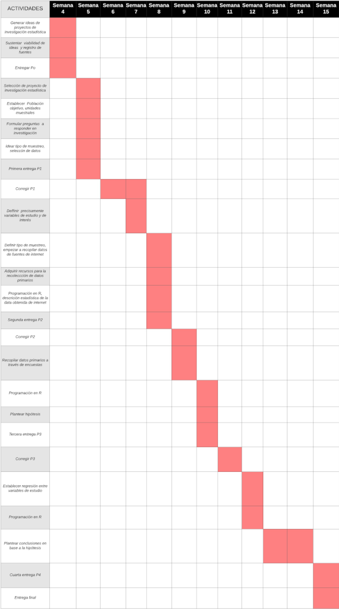

<style> body {text-align: justify} </style>

```{r,echo=FALSE,message=FALSE}
source("plots.r")
knitr::read_chunk("plots.r")
```

[](https://github.com/2020-01-est-19/proyecto/actions?query=workflow%3A%22R+CI%22)
[](./pres.html)
[](https://github.com/2020-01-est-19/proyecto)

# Profesor:
* Jose Miguel Renom

# Curso:
* Estadística y Probabilidades

# Integrantes
* Génesis Flores Arroyo
* Angel Salvador Calleja Castillo
* Esteban Villacorta Garcia
* Alberto Oporto Ames
* Ricardo Atsuhiko Yamamoto Yamamoto

# Líder
* Génesis Flores Arroyo

# Introducción
El COVID-19 ha tenido un gran impacto alrededor del mundo y hoy en dia es fácilmente
el tema del que más se habla.
Todos los países han tomado medidas con respecto a esta pandemia,
sin embargo unos las han tomado muy tarde y esto se ha visto afectado en la expansión
del virus en ellos.
En Perú, las medidas se empezaron a tomar rápidamente,
pero una cantidad considerable de la población no ha cumplido con las inmovilizaciones
sociales y esto se ha visto reflejado en la expansión del virus en el país.
¿Cómo podemos saber cuáles han sido las medidas más respetadas y por qué?
La respuesta a esta pregunta le sería de mucha ayuda al gobierno peruano,
ya que con esta información se podría saber que tipo de medidas debería tomar y en qué
momentos para que se cumplan de manera satisfactoria.
Es por ello que nuestro grupo ha decidido investigar acerca de la efectividad de las
medidas tomadas y su relación con la movilización social de los ciudadanos.

# Factibilidad
Este trabajo es factible, debido a que la mayor parte de la información la podemos
conseguir de gráficos ya existentes con relación al COVID-19 en Perú y la información
faltante la podemos adquirir a través de encuestas.
Además, los efectos de las medidas tomadas por el gobierno en la movilización social ya
se pueden analizar, debido a que su información se obtiene solamente días después de
implementarlas.
Finalmente, esta investigación se puede llevar a cabo en el tiempo dado,
debido a que no es un trabajo que requiera tiempo de espera para llegar a concretarse.
Esto quiere decir que lo podemos empezar inmediatamente.

# Objetivos
La importancia de este estudio estadístico radica en el análisis de algunas de las
medidas que el gobierno ha declarado ante la coyuntura del Covid-19.
Es importante estudiar su efecto en la movilización social,
puesto que podría otorgar un panorama más holístico y verídico sobre las medidas que
generan un impacto positivo en la desaceleración de la propagación del
nuevo virus Sars-CoV-2.

## Objectivos generales
* El objetivo de este trabajo es determinar en qué medida las diferentes acciones
que ha aplicado el gobierno, desde el inicio del periodo de cuarentena hasta el
tiempo del estudio,  redujeron el impacto y expansión
del Covid-19 en el Perú.
Queremos averiguar el efecto de estas medidas en 2 diferentes aspectos.
Estos son: la movilización social y
de qué manera afectan la curva de aumento de infectados por coronavirus en Perú.

## Objetivos específicos
* Establecer las medidas a estudiar y que estas se encuentren alineadas a
la inmovilización social.
* Analizar la situación de la ciudad de Lima en el caso hipotético de
“Declaración de emergencia fuera de tiempo”.
* Establecer los factores que determinan la prestación de servicios públicos y
su relación con la propagación del virus.
* Establecer una relación entre el bono subsidio y
el desacato a la inmovilización social.
* Establecer las principales razones de las personas para
desobedecer la inmovilización social.

# Marco Teórico

## Población objetivo
La población de interés son los ciudadanos peruanos.
Para lograr que nuestras unidades muestrales sean los más representativa posible,
hemos decidido delimitar nuestra población objetivo al área de Lima.
Esto se debe a que nuestros encuestados se encuentran en esta zona y
la mayor cantidad de población se encuentra aquí.

## Unidad muestral
* Para las encuestas nuestra unidad muestral son los alumnos de la Universidad UTEC y sus familias [18 - 50 años]
* Con respecto a los datos y gráficos brindados por la web, nuestra unidad muestral es la ciudad de Lima.
* Accederemos a las observaciones y/o mediciones de las unidades muestrales mediante
fuentes de internet que presentan fiabilidad, respaldo del gobierno.
Del mismo modo, se realizarán encuestas a los alumnos de UTEC y sus familiares
a través de preguntas relacionadas con su movilización social antes y durante la
cuarentena.
Ello con el propósito de encontrar las razones de movilización

## Muestreo
Tipo de muestreo

El tipo de muestreo es aleatorio simple estratificado para ciudadanos con edades
entre 18-50 años.
Ello, dado que todos los individuos de subconjunto de la población objetivo
tienen la misma probabilidad de ser seleccionados.

## Tamaño de la muestra
* Finita

# Proveniencia de los datos
Existen varias fuentes de la que es posible extraer la información necesaria
para responder las preguntas.

* Compendio de normas emitidas por el Estado Peruano para afrontar la propagación
  del Covid-19. (1 de febrero de 2020 al 7 de mayo de 2020)
* Normativa sobre Estado de Emergencia por Coronavirus.
* Acciones adoptadas por el gobierno ante COVID-19 (2020)
* COVID-19 Community Mobility Report (2020).

*Nota: Todas se encuentran citadas en bibliografía.*

La información contenida en estas direcciones son originales,
además de confiables, dado que se presenta cada medida con su respectivo decreto
legislativo.
Asimismo, los datos estadísticos cuentan con sustento de fuentes oficiales.

# Uso de datos

Con respecto al uso de los datos obtenidos de fuentes, tenemos claro cómo utilizar cada uno de ellos.
La fuente de la que adquirimos la información respecto a las medidas tomadas nos es de
mucha ayuda, ya que junto a ellas están las fechas en las que se llevaron a cabo.
Esto nos permite analizar la población antes y después de que se implementarán
estas medidas.

Las fuentes de las que adquirimos las gráficas de inmovilización social también nos
son de gran ayuda porque nos permiten relacionar las fechas en las que se llevaron
a cabo las medidas gubernamentales con el flujo de gente en las calles.
Esta relación es muy importante, ya que nos permitirá analizar la efectividad de
los decretos y nos ayudará a lograr nuestros objetivos.
El procesamiento de la data obtenida en las fuentes es muy importante,
debido a que por sí solas nos muestran información “cruda” que todo el mundo ya conoce.
Al procesar esta data y relacionarla con otra/s, la investigación se vuelve más
interesante, ya que las relaciones entre diferentes estadísticas son
posiblemente desconocidas y le brindan información mucho más útil al lector.

# Planificación




# Medidas elegidas

1. Decreto de estado de emergencia.
    - ¿Cuál fue el efecto que tuvo el decreto de estado de emergencia en
    la población emocionalmente? (Exploratoria)

2. Decreto de Urgencia que dicta medidas extraordinarias con la finalidad de
adquirir bienes y servicios necesarios para el alojamiento en cuarentena y
alimentación de las personas que deban desplazarse dentro del país a
consecuencia de la declaración del Estado de Emergencia Nacional por el COVID-19 (380)
    - ¿La cantidad de personas que se vieron beneficiadas por este decreto fue
    suficiente para que se reduzca considerablemente el tránsito de gente? (Inferencial)

3. Aprueban el Padrón de los hogares en condición de pobreza o pobreza extrema
beneficiarios del subsidio monetario de acuerdo al Sistema de Focalización de
Hogares (SISFOH) que se encuentren en los ámbitos geográficos con mayor
vulnerabilidad sanitaria en el marco del D.U. N° 027-2020 (68)
    - ¿La tasa de personas que reciben la bonificación por día fue alcanzable a la
    mayoría de personas del sector vulnerable? (Descriptiva)

4. Disposición presidencial que permite la salida de hombres y mujeres en días
complementarios (lunes-miércoles-viernes / martes-jueves-sábados)
    - ¿Qué diferencia hubo en el tránsito de personas entre los días para hombres y
    para mujeres? (Descriptiva)
    - ¿A dónde se dirige la mayor parte del flujo de personas? ¿Qué razón explicaría esto? (Exploratoria)

##  Preguntas propuestas para estudio (para los encuestados)

|N° | Pregunta | Tipo |
|---|----------|------|
|1  |¿Qué edad tienen los miembros de la muestra?| Descriptiva|
|2  |¿De qué género son?| Descriptiva|
|3  |¿Cuánto es su ingreso promedio?| Descriptiva|
|4  |¿En qué distrito vives?| Descriptiva|
|5  |¿Cuál fue el último nivel educativo que cursaron?| Descriptiva|
|6  |¿Es su tipo de empleo uno formal o informal?| Descriptiva|
|6  |¿Qué tan frecuentemente salía de casa previamente al comienzo de la cuarentena?| Descriptiva|
|7  |¿Qué medidas gubernamentales son las que recuerdan que se hayan tomado?| Descriptiva|
|8  |¿Qué tanto consideras que tu distrito se ha visto afectado por la enfermedad?| Descriptiva|
|9  |¿Por qué razones salías durante la cuarentena?| Descriptiva|
|10 |¿Consideras que la medida X fue efectiva para reducir el número de contagios en tu distrito?| Descriptiva|
|11 |¿Qué condiciones crees que aceleran la propagación del Covid en tu distrito?| Descriptiva|
|12 |¿Qué condiciones crees que aceleran / retardan la propagación del Covid en tu distrito?| Descriptiva|

##  Preguntas propuestas para estudio (para la data)


|N° | Pregunta | Tipo |
|---|----------|------|
|1  |¿Qué tan frecuentemente salía la población en una fecha determinada respecto al promedio?| Inferencial|
|2  |¿Qué tanto varían las cifras de nuevos infectados durante los periodos de instauración previos-posteriores a la medida?| Descriptiva|
|3  |¿Qué poblaciones se ven más afectadas por la enfermedad durante las medidas de aislamiento? ¿Cómo varía esto respecto a periodos anteriores a su promulgación?| Descriptiva|
|4  |¿Se pueden prevenir errores - proveer mejores opciones respecto a medidas preventivas a partir de estas características?| Exploratoria|
|5  |¿Como se vio afectado el tránsito de personas en los días previos a la implementación?| Descriptiva|
|6  |¿Cuáles han sido las medidas que han tenido mayor impacto en la población?| Inferencial|
|7  |¿Cómo ciertas condiciones determinan que la propagación del COVID se acelere / retarde?| Causal|

# Variables

|Variable| Tipo de variable|
|--------|-----------------|
|Edad| Cuantitativa discreta|
|Género| Cualitativa nominal|
|Clase social| Cualitativa ordinal|
|Nivel educativo alcanzado| Cualitativa ordinal|
|Tipo de trabajo| Cualitativa nominal|
|Frecuencia de salida | Cuantitativa discreta|
|Lugar donde vive (distrito)| Cualitativa nominal|
|Cantidad de infectados por dia| Cuantitativa discreta|
|Tiempo (dias)| Cuantitativa discreta|
|Justificacion de salida| Cualitativa nomilal|
|Medidas aplicadas| Cualitativa nominal|
|Cantidad de personas observadas en lugares públicos (mercado, hospital)| Cualitativa ordinal|
|Cantidad de personas que respeta las normas de distanciamiento social en público| Cualitativa ordinal|

## Descriptores numéricos para las variables de mayor importancia:

### Data web
* Frecuencia de salida de personas (antes y después): Utilizamos mediana y media.
* Cantidad de infectados por día: Utilizamos media.
* Edad: Utilizamos la mediana para relacionar rangos de edades con las repuestas brindadas por las personas en las encuestas.

### Encuestas
Se realizará una encuesta para aproximadamente 100 personas, en el cual se formularán preguntas con las siguientes variables:
* Frecuencia de salida promedio al día antes del inicio de cuarentena
* Frecuencia de salida promedio al día luego de la medida del gobierno
* Cantidad  aproximada de personas que observó en lugares públicos (mercado, hospital) luego de aplicadas las medidas del gobierno. Esto se medirá mediante un indicador categórico ordinal.
* Cantidad de personas aproximada que observó cumplir con el distanciamiento social de 1 metro, luego de las medidas del gobierno. Esto se medirá mediante un indicador categórico ordinal
* Tipo de trabajo (formal / informal)
* Edad
* Género
* Distrito
* Clase social
* Nivel educativo

# Descriptores gráficos

Utilizaremos:

Gráfica de dispersión para notar fácilmente como aumenta o decrece la cantidad de infectados e infectados por dia antes y después de que se aplique la medida.
Además, la gráfica de dispersión nos puede ayudar a encontrar una relación y/o patrón entre la cantidad de infectados y/o movilización social y los días transcurridos desde que se empleó cada medida.

# Obtención y Procesamiento de Resultados


```{r,echo=FALSE,message=FALSE,results="asis"}
repeat_plots("2020-03-05", "2020-03-25", "Declaración de Estado de Emergencia")
repeat_plots("2020-03-08", "2020-03-28", "Aprobación del Padrón de Hogares")
repeat_plots("2020-03-24", "2020-04-13", "Salida alternada por género")
repeat_plots("2020-04-10", "2020-04-30", "Permiso de adquisición de bienes y servicios basicos")
```

# Discusión de resultados

## Patrones:
* Pudimos notar que la curva de casos totales muestra un crecimiento continuo en el tiempo, evidenciándose un incremento de personas infectadas significativo  entre antes y después de haber tomado cada medida.
* En cuanto a los nuevos casos por día pudimos notar que todas las gráficas muestran una variación considerable en la cantidad de casos diarios pocos días después de que se aplicara cada medida. Estas variaciones se ven como datos atípicos en las gráficas.
* En las gráficas de movilización social si se puede ver claramente el efecto de las medidas respectivas en ellas. El estado de emergencia hizo que la movilización social disminuyera en gran medida y la norma de salir días específicos de la semana también tuvo un impacto en la movilización ciertos días de la semana.


# Bibliografía

- Google LLC. (2020). Google COVID-19 Community Mobility Reports Peru.. Recuperado el 7 de mayo de 2020, de Google LLC Sitio Web: https://www.gstatic.com/covid19/mobility/2020-04-11_PE_Mobility_Report_en.pdf
- Anónimo (2020). Acciones adoptadas por el gobierno ante COVID-19. Recuperado el 7 de mayo de 2020, de Velose Sitio Web: https://www.velose.pe/noticias/acciones-adoptadas-por-el-gobierno-ante-covid-19/
- Gobierno del Perú (2020). Normativa sobre Estado de Emergencia por Coronavirus. Recuperado el 7 de mayo de 2020 de Plataforma digital del Estado Peruano Sitio Web: https://www.gob.pe/institucion/pcm/colecciones/787-normativa-sobre-estado-de-emergencia-por-coronavirus
- Defensoría del Pueblo (2020). COMPENDIO DE NORMAS EMITIDAS POR EL ESTADO PERUANO PARA AFRONTAR LA PROPAGACIÓN DEL COVID-19. Recuperado el 7 de mayo de 2020 de Defensoria del Pueblo Sitio Web: https://www.defensoria.gob.pe/wp-content/uploads/2020/05/Compendio-de-Normas-COVID19-07.05.2020.pdf
